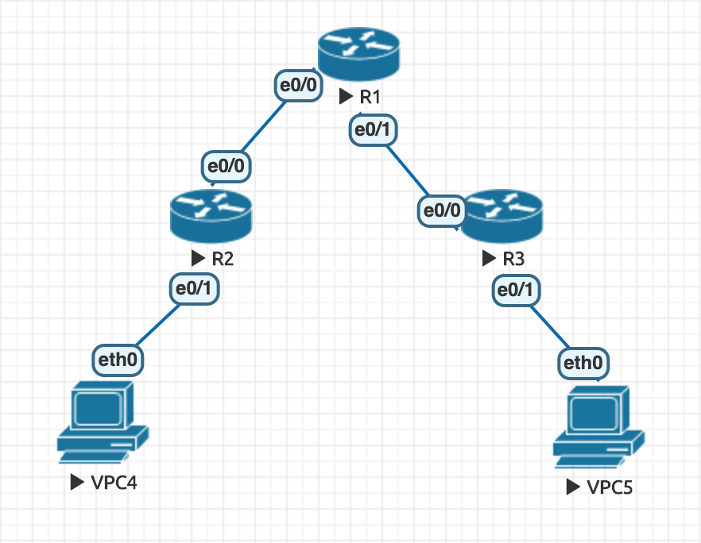

# DHCP: Dynamic Host Configuration Protocol

- [DHCP: Dynamic Host Configuration Protocol](#dhcp-dynamic-host-configuration-protocol)
  - [Configure DHCP](#configure-dhcp)
  - [DHCP Lease Time (租借時間)](#dhcp-lease-time-%e7%a7%9f%e5%80%9f%e6%99%82%e9%96%93)
  - [DHCP DORA](#dhcp-dora)
  - [DHCP Relay](#dhcp-relay)

## Configure DHCP

- 延續 [VLAN 間通訊方式的方法 1](VLAN.md#%e6%96%b9%e6%b3%95-1switch-virtual-interface-svi)，原本都是設置靜態 IP

```
// SW (layer 3)

Switch>enable
Switch#configure terminal
Switch(config)#ip dhcp pool vlan10
Switch(dhcp-config)#network 192.168.10.0 255.255.255.0
Switch(dhcp-config)#default-router 192.168.10.254
Switch(dhcp-config)#dns-server 8.8.8.8 8.8.4.4
Switch(dhcp-config)#exit
Switch(config)#ip dhcp excluded-address 192.168.10.250 192.168.10.254 // 排除 192.168.10.250-192.168.10.254 不會被 dhcp server 使用

Switch(config)#ip dhcp pool vlan20
Switch(dhcp-config)#network 192.168.20.0 255.255.255.0
Switch(dhcp-config)#default-router 192.168.20.254
Switch(dhcp-config)#dns-server 8.8.8.8 8.8.4.4
Switch(dhcp-config)#exit
Switch(config)#ip dhcp excluded-address 192.168.20.250 192.168.20.254


// VPC2
VPCS> clear ip // 先清除 IP
IPv4 address/mask, gateway, DNS, and DHCP cleared

VPCS> show ip // 確認 IP 是否清空

NAME        : VPCS[1]
IP/MASK     : 0.0.0.0/0
GATEWAY     : 0.0.0.0
DNS         : 
MAC         : 00:50:79:66:68:02
LPORT       : 20000
RHOST:PORT  : 127.0.0.1:30000
MTU         : 1500

VPCS> ip dhcp
DDORA IP 192.168.10.1/24 GW 192.168.10.254

VPCS> show ip

NAME        : VPCS[1]
IP/MASK     : 192.168.10.1/24
GATEWAY     : 192.168.10.254
DNS         : 8.8.8.8  8.8.4.4
DHCP SERVER : 192.168.10.254
DHCP LEASE  : 86398, 86400/43200/75600
MAC         : 00:50:79:66:68:02
LPORT       : 20000
RHOST:PORT  : 127.0.0.1:30000
MTU         : 1500


// VPC3
VPCS> clear ip
IPv4 address/mask, gateway, DNS, and DHCP cleared

VPCS> show ip

NAME        : VPCS[1]
IP/MASK     : 0.0.0.0/0
GATEWAY     : 0.0.0.0
DNS         : 
MAC         : 00:50:79:66:68:03
LPORT       : 20000
RHOST:PORT  : 127.0.0.1:30000
MTU         : 1500

VPCS> ip dhcp
DDORA IP 192.168.20.1/24 GW 192.168.20.254

VPCS> ping 192.168.10.1

84 bytes from 192.168.10.1 icmp_seq=1 ttl=63 time=2.574 ms
84 bytes from 192.168.10.1 icmp_seq=2 ttl=63 time=0.967 ms


// SW
enable
configure terminal
interface e0/2
switchport mode access
switchport access vlan 10
```

- 但由於一般 DHCP 都放在 Router 而非 Switch，因此下方操作是沿用方法 3 的做法

```
show ip dhcp pool // 可以查看 dhcp 狀態
show ip dhcp binding
```

## DHCP Lease Time (租借時間)

- 如果租借時間太長，可能會保留太多無用的 IP Address，讓新使用者無法取得 IP Address
- 實務上，無線網路租借時間建議約 4 hrs

## DHCP DORA

- 參考：[Dynamic Host Configuration Protocol (DHCP) - GeeksforGeeks](https://www.geeksforgeeks.org/dynamic-host-configuration-protocol-dhcp/)
- 名稱來自四個步驟的首字
- Port
  - Server: 67
  - Client: 68
- 分為四個步驟（皆為廣播）：
  1. Discover
  2. Offer
  3. Request
  4. Acknowledge

## DHCP Relay

- 參考：[Jan Ho 的網絡世界 - Dynamic Host Configuration Protocol (DHCP) 動態主機分配協定](https://www.jannet.hk/zh-Hant/post/dynamic-host-configuration-protocol-dhcp/#relay)
- 


```
// R1
Router>enable
Router#configure terminal
Router(config)#interface e0/0
Router(config-if)#ip addr 192.168.12.1 255.255.255.0
Router(config-if)#no shutdown
Router(config-if)#interface e0/1
Router(config-if)#ip addr 192.168.13.1 255.255.255.0
Router(config-if)#no shutdown


// R2
Router>enable
Router#configure terminal
Router(config)#interface e0/0
Router(config-if)#ip addr 192.168.12.2 255.255.255.0
Router(config-if)#no shutdown
Router(config-if)#interface e0/1
Router(config-if)#ip addr 192.168.10.254 255.255.255.0
Router(config-if)#no shutdown
Router(config-if)#do ping 192.168.12.1
Type escape sequence to abort.
Sending 5, 100-byte ICMP Echos to 192.168.12.1, timeout is 2 seconds:
.!!!!
Success rate is 80 percent (4/5), round-trip min/avg/max = 1/1/1 ms


// R3
Router>enable
Router#configure terminal
Router(config)#interface e0/0
Router(config-if)#ip addr 192.168.13.3 255.255.255.0
Router(config-if)#no shutdown
Router(config-if)#interface e0/1
Router(config-if)#ip addr 192.168.20.254 255.255.255.0
Router(config-if)#no shutdown
Router(config-if)#do ping 192.168.13.1
Type escape sequence to abort.
Sending 5, 100-byte ICMP Echos to 192.168.13.1, timeout is 2 seconds:
.!!!!
Success rate is 80 percent (4/5), round-trip min/avg/max = 1/4/5 ms


// R1
Router(config-if)#ip dhcp pool mylan1
Router(dhcp-config)#network 192.168.10.0 255.255.255.0
Router(dhcp-config)#default-router 192.168.10.254
Router(dhcp-config)#dns-server 8.8.8.8
Router(dhcp-config)#exit
Router(config)#ip dhcp pool mylan2
Router(dhcp-config)#network 192.168.20.0 255.255.255.0
Router(dhcp-config)#default-router 192.168.20.254
Router(dhcp-config)#dns-server 8.8.8.8
Router(dhcp-config)#ip route 192.168.10.0 255.255.255.0 192.168.12.2
Router(config)#ip route 192.168.20.0 255.255.255.0 192.168.13.3


// R2
Router(config-if)#interface e0/1
Router(config-if)#ip helper-address 192.168.12.1


// R3
Router(config-if)#interface e0/1
Router(config-if)#ip helper-address 192.168.13.1


// VPC4
ip dhcp // 如果失敗的話，可以重複輸入幾次就會成功


// VPC5
ip dhcp

```