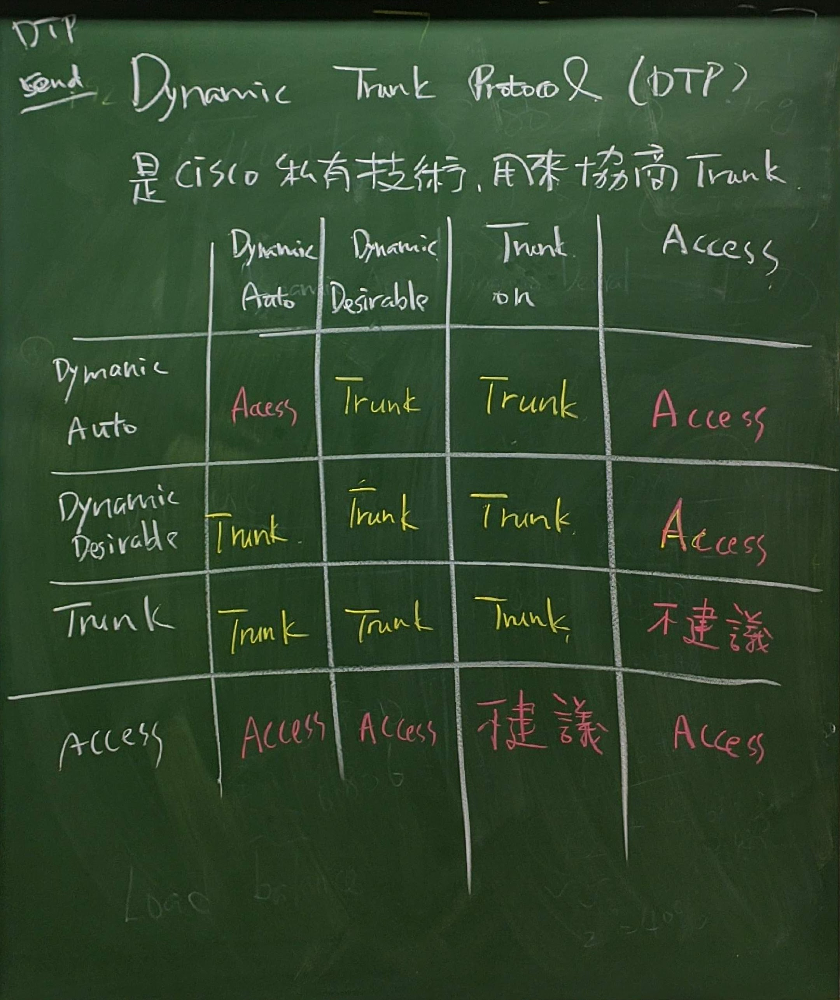

# DTP: Dynamic Trunking Protocol



- 可把 Dynamic Auto 想成被動者，因此兩個被動者會走 Access

---

- 封包都會定期發送，會佔據到頻寬
- 如果已經手動設定好 Trunk，建議可以設定此選項，就能避免再次進行 DTP 協商

SW1, SW2
```
switchport nonegotiate
```

SW1
```
int e0/0
no switchport nonegotiate
switchport mode dynamic auto
```

SW2
```
int e0/0
no switchport nonegotiate
switchport mode dynamic auto
do show int trunk # 此時不會顯示任何內容，代表為 Access mode
```