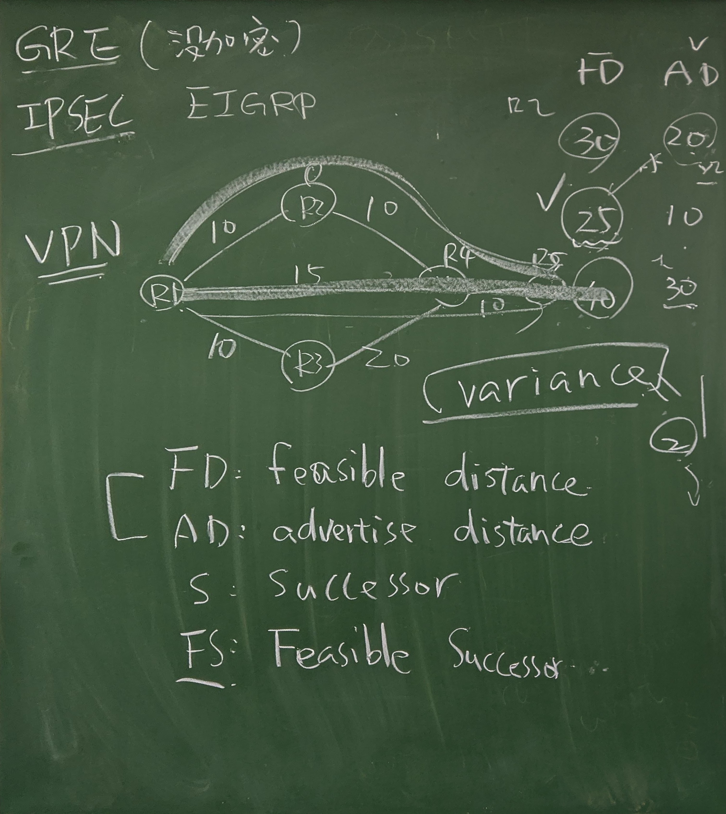

# EIGRP

- [EIGRP](#eigrp)
  - [協議基本配置](#%e5%8d%94%e8%ad%b0%e5%9f%ba%e6%9c%ac%e9%85%8d%e7%bd%ae)
  - [路由傳遞過程](#%e8%b7%af%e7%94%b1%e5%82%b3%e9%81%9e%e9%81%8e%e7%a8%8b)
    - [Pro tip: Wild card（反掩碼）](#pro-tip-wild-card%e5%8f%8d%e6%8e%a9%e7%a2%bc)
  - [EIGRP 5 種訊息介紹](#eigrp-5-%e7%a8%ae%e8%a8%8a%e6%81%af%e4%bb%8b%e7%b4%b9)
  - [EIGRP 3 tables](#eigrp-3-tables)
  - [EIGRP 非等價路由](#eigrp-%e9%9d%9e%e7%ad%89%e5%83%b9%e8%b7%af%e7%94%b1)
    - [自動(auto summary)與手工匯總](#%e8%87%aa%e5%8b%95auto-summary%e8%88%87%e6%89%8b%e5%b7%a5%e5%8c%af%e7%b8%bd)
  - [EIGRP 鄰居驗證](#eigrp-%e9%84%b0%e5%b1%85%e9%a9%97%e8%ad%89)
    - [驗證步驟](#%e9%a9%97%e8%ad%89%e6%ad%a5%e9%a9%9f)
    - [實作](#%e5%af%a6%e4%bd%9c)
  - [Reference](#reference)

## 協議基本配置

- Enhance Interior Gateway Route Protocol
- Cons:
  1. hops isn't a great metrics to determine the quality
  2. Not suited for large network, cuz:
     1. RIP support up to 15 hops, 16 hops isn't available
     2. 30s/180s convergence time is too slow
  3. RIP protocol update the full router table, it will occupy bandwidth
- Features:
  - Cisco private protocl, only available in Cisco router
  - Dynamic routering protocol
  - high-level distance/ mixed vector routering protocol
  - IGP
  - 無類路由協議

> convergence time(收斂時間): network topology changes ~ router tables finish and stablize in all the router

## 路由傳遞過程

R1
```
router eigrp
```

R2
```
router eigrp
network eigrp 1 # 1 為 AS(Autonomy System number, 自治系統號)
network 10.0.0.0
auto-summary

# After configuration, you can show the eigrp status
show ip eigrp neighbors

# H: 與鄰居建立的順序
# Address: neighbor's IP address
# Interface: port that set up connection with neighbor
# Hold: usually 0~15 secs
# Uptime: time 
# SRTT: 平均往返時間，發送一個訊息到接收這個訊息的回應所需要的時間
# RTO: 超時重傳時間
```

### Pro tip: Wild card（反掩碼）

- 定義剛好與遮罩（mask）相反
  - 0 代表要完整匹配
  - 255 代表完全不匹配
- 0.0.0.255（轉換成正常的 mask 為 255.255.255.0）
- `network 0.0.0.0 0.0.0.0` 代表任意網路

## EIGRP 5 種訊息介紹

1. Hello message()
   - set up neighbor's relation, not for transfer router info
   - multicast, 5s/ 15s
2. Update
3. Query: when router list changed, it will sent Query message
4. Replay
5. ACK

## EIGRP 3 tables

1. neighbor table

    ```
    show ip eigrp neighbors
    ```

2. topology table

    ```
    show ip eigrp topology
    show ip topology all-links # 查看從鄰居學習到的前後路由條目
    ```

    

    - FD(Feasible Distance): 本路由器到目標網段的 Metric
    - AD(Advertise Distance): 鄰居路由器到目標網段的 Metric
      - 並不等同於 Administrative Distance, AD
    - S(Successor): 到達目標網段最小 Metric 的鄰居路由器
    - FS(Feasible Successor): AD 小於 FD 的鄰居路由器

3. routing table

   - 只顯示最佳傳輸路徑或 ECMP

   ```
   show ip route
   show ip route eigrp # only show eigrp protocol
   ```

## EIGRP 非等價路由

- 到達相同的目標網段有不同的下一跳
- 等價路由: 同時具有相同的 AP 和不同的 Metric
- 條件:
  1. 能夠滿足 FC(Feasible Condition): AD < FD value
  2. `variance` n * AD > FD

### 自動(auto summary)與手工匯總

- IOS 12.4 以前的版本彙總預設是開啟的，需要手工關閉
- IOS 12.5 以後的版本匯總預設是關閉的

R4
```
int f0/1
ip summary-address eigrp 90 172.16.22.0 255.255.254.0

int f0/0
ip summary-address eigrp 90 172.16.22.0 255.255.254.0

ip summary-address eigrp 90 172.0.0.0 255.0.0.0 // 匯總到超網
```

## EIGRP 鄰居驗證

### 驗證步驟

1. Key-chain: 鑰匙串
2. Key: 鑰匙串中的一把鑰匙
3. Key-string: 鑰匙凹凸的特徵
4. 在 interface 聲明
5. 在 interface 下調用

### 實作

R1
```
key chain cisco # cisco 為自己取的名字
Key 1
key-string cisco123
```

R2
```
key chain cisco # cisco 為自己取的名字
Key 1
key-string cisco123
```

R1
```
ip authentication mode eigrp 90 md5
ip authentication key-chain eigrp 90 cisco
```

R1
```
router eigrp 90
network 123.0.0.0
network 192.168.1.0
neighbor 123.1.1.2 FastEthernet0/0
neighbor 123.1.1.3 FastEthernet0/0
```

R2
```
sh run | sec eigrp
router eigrp 90
network 123.0.0.0
netwokr 192.168.2.0
neightbor 123.1.1.1 FastEthernet0/0
```

## Reference

1. [EIGRP 介绍与分类-51CTO学院](https://edu.51cto.com/center/course/lesson/index?id=290765)