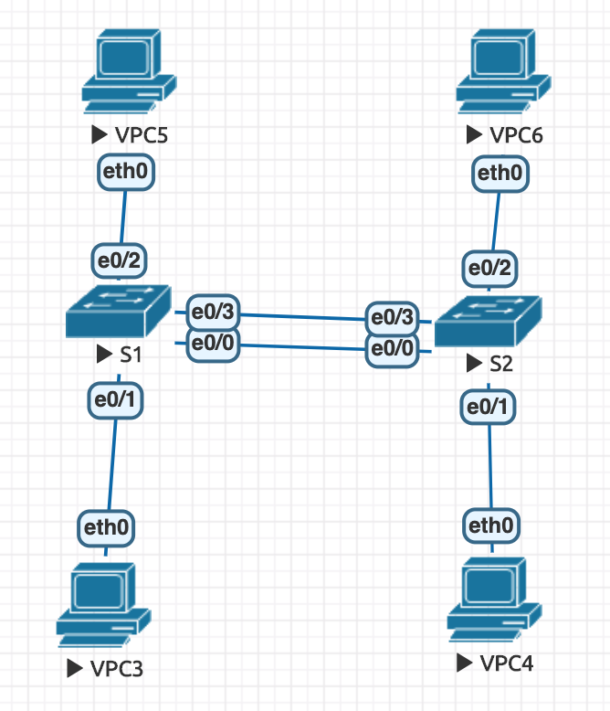
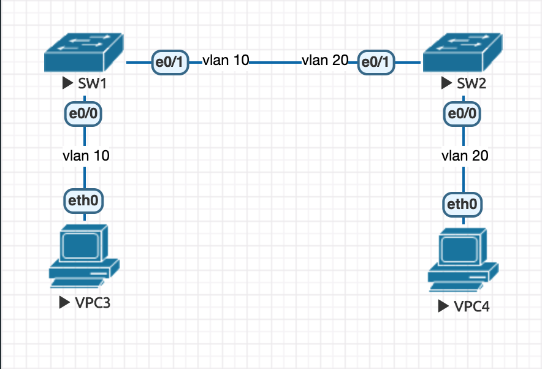
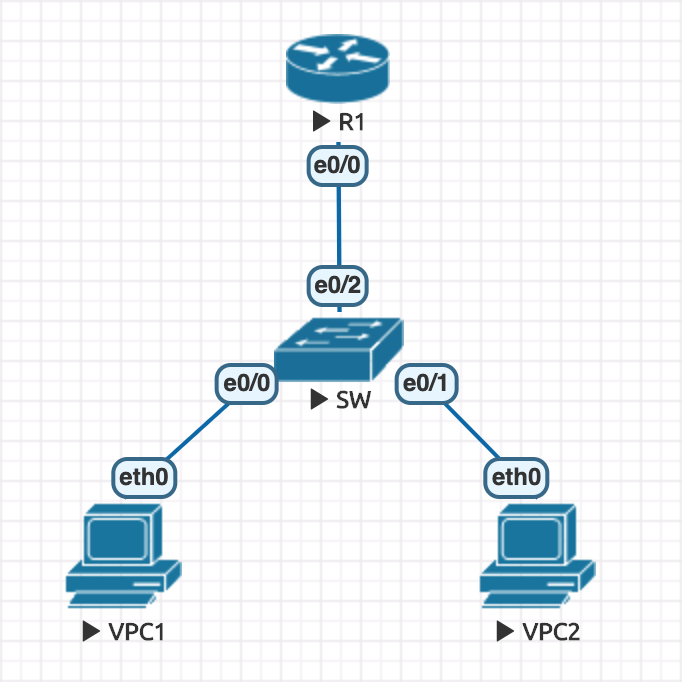

# VLAN: Virtual LAN

- [VLAN: Virtual LAN](#vlan-virtual-lan)
  - [VLAN Concept](#vlan-concept)
  - [Experiment](#experiment)
    - [Exp.1](#exp1)
    - [Exp.2 將兩個 vLAN 通道整合成一個 Trunk](#exp2-%e5%b0%87%e5%85%a9%e5%80%8b-vlan-%e9%80%9a%e9%81%93%e6%95%b4%e5%90%88%e6%88%90%e4%b8%80%e5%80%8b-trunk)
    - [Exp.3](#exp3)
    - [Exp.4](#exp4)
  - [VLAN 間通訊方式](#vlan-%e9%96%93%e9%80%9a%e8%a8%8a%e6%96%b9%e5%bc%8f)
    - [方法 1：Switch Virtual Interface, SVI](#%e6%96%b9%e6%b3%95-1switch-virtual-interface-svi)
    - [方法 2：跨 Switch 通訊](#%e6%96%b9%e6%b3%95-2%e8%b7%a8-switch-%e9%80%9a%e8%a8%8a)
    - [方法 3：單臂路由](#%e6%96%b9%e6%b3%95-3%e5%96%ae%e8%87%82%e8%b7%af%e7%94%b1)
    - [結論](#%e7%b5%90%e8%ab%96)

## VLAN Concept

- 為了方便管理，VLAN 能命名（註：名字僅用來識別）
- Router 能將同個 VLAN ID 分隔（可以想像成不同公司會有同樣的 VLAN ID，但無法直接進行通訊）
- Access port 不會打標籤，只有 Trunk port 才會

## Experiment

### Exp.1



VPC5
```
ip 192.168.1.1 255.255.255.0
```

VPC6
```
ip 192.168.1.2 255.255.255.0
```

VPC3
```
ip 192.168.2.3 255.255.255.0
```

VPC4
```
ip 192.168.2.4 255.255.255.0
```

SW1
```
enable
configure terminal
hostname SW1
vlan 10
name aa
exit
vlan 20
name bb
do show vlan brief
int range e0/2, e0/3
switchport mode access
switchport access vlan 10
int range e0/0, e0/1
switchport mode access
switchport access vlan 20
do show vlan brief
```

SW2
```
enable
configure terminal
hostname SW2
vlan 10
name aa
exit
vlan 20
name bb
do show vlan brief
int range e0/2, e0/3
switchport mode access
switchport access vlan 10
int range e0/0, e0/1
switchport mode access
switchport access vlan 20
do show vlan brief
```

### Exp.2 將兩個 vLAN 通道整合成一個 Trunk

- Trunk
  - 802.1Q
  - ISL(cisco)

SW2
```
enable
configrue terminal
int e0/0
switchport trunk encapsulation dot1q
switchport mode trunk
```

SW1
```
enable
configure terminal
int e0/2
switchport mode access
switchport access vlan 10
int e0/1
switchport mode access
switchport access vlan 20
do show vlan brief
int e0/0
switchport trunk encapsulation dot1q
switchport mode trunk

do show vlan brief # 不能看到剛剛設定的資訊
do show int trunk
```

- 如果設定為 Native vLAN，不會打加上 ID
- Native vLAN 的 Switch 之間需要設定同樣的 ID

### Exp.3

- 架構圖：

> 註：這邊的 Switch 皆為 Layer 2 Switch




```
// VPC3
VPCS> ip 192.168.10.1 255.255.255.0


// VPC4
VPCS> ip 192.168.10.2 255.255.255.0


// SW1
Switch>enable
Switch#configure terminal
Switch(config)#hostname SW1

SW1(config)#interface e0/0
SW1(config-if)#switchport mode access
SW1(config-if)#switchport access vlan 10

SW1(config-if)#interface e0/1
SW1(config-if)#switchport mode access
SW1(config-if)#switchport access vlan 10
SW1(config-if)#exit
SW1(config)#
*Dec 31 22:16:22.479: %CDP-4-NATIVE_VLAN_MISMATCH: Native VLAN mismatch discovered on Ethernet0/1 (10), with Switch Ethernet0/1 (1).
SW1(config)#no cdp advertise-v2 // 因為 cisco ver.2 多個 Native VLAN 的欄位，所以沒設定 Native VLAN 會出現 mismatch 而無法連線。所以要正常連線要下這行指令，而此問題只有兩台 cisco 機器連線時會出現。


// SW2
Switch>enable
Switch#configure terminal
Enter configuration commands, one per line.  End with CNTL/Z.
Switch(config)#hostname SW2

SW2(config)#interface e0/0
SW2(config-if)#switchport mode access
SW2(config-if)#switchport access vlan 20
% Access VLAN does not exist. Creating vlan 20

SW2(config-if)#interface e0/1
SW2(config-if)#switchport mode access
SW2(config-if)#switchport access vlan 20
SW2(config-if)#exit
SW2(config)#no cdp advertise-v2
```

- 設置完成後，VPC3, VPC4 可以互相 ping 到

```
// VPC3
VPCS> ping 192.168.10.2

84 bytes from 192.168.10.2 icmp_seq=1 ttl=64 time=0.731 ms


// VPC4
VPCS> ping 192.168.10.1

84 bytes from 192.168.10.1 icmp_seq=1 ttl=64 time=1.502 ms
```

### Exp.4

- 架構圖：

> 註：這邊的 Switch 皆為 Layer 2 Switch


- 延續實驗 3，如果實驗 3 已做過以下內容不需輸入：

```
// VPC3
VPCS> ip 192.168.10.1 255.255.255.0


// VPC4
VPCS> ip 192.168.10.2 255.255.255.0
```

- 接續進行操作：

```
// SW1
SW1(config)#default interface range e0/0-1 // 重設介面卡的內容，若非延續實驗 3 則不須輸入
SW1(config)#interface e0/0
SW1(config-if)#switchport trunk encapsulation dot1q
SW1(config-if)#switchport mode trunk
SW1(config-if)#switchport trunk native vlan 10

SW1(config-if)#interface e0/1
SW1(config-if)#switchport trunk encapsulation dot1q
SW1(config-if)#switchport mode trunk
SW1(config-if)#switchport trunk native vlan 20


// SW2
SW2(config)#default interface range e0/0-1 // 重設介面卡的內容，若非延續實驗 3 則不須輸入
SW2(config)#interface e0/0
SW2(config-if)#switchport mode access
SW2(config-if)#switchport access vlan 10

SW2(config-if)#interface e0/1
SW2(config-if)#switchport trunk encapsulation dot1q
SW2(config-if)#switchport mode trunk
SW2(config-if)#switchport trunk native vlan 30
```

- 設置完成後，VPC3, VPC4 可以互相 ping 到

```
// VPC3
VPCS> ping 192.168.10.2

84 bytes from 192.168.10.2 icmp_seq=1 ttl=64 time=0.782 ms


// VPC4
VPCS> ping 192.168.10.1

84 bytes from 192.168.10.1 icmp_seq=1 ttl=64 time=1.955 ms
```

## VLAN 間通訊方式

### 方法 1：Switch Virtual Interface, SVI

- 檔案：W14 SVI

```
// SW
Switch>enable
Switch#configure terminal
Switch(config)#interface e0/0
Switch(config-if)#switchport mode access
Switch(config-if)#switchport access vlan 10
Switch(config)#interface e0/1
Switch(config-if)#switchport mode access
Switch(config-if)#switchport access vlan 20

Switch(config-if)#ip routing
Switch(config)#vlan 10
Switch(config-vlan)#vlan 20
Switch(config-vlan)#do show vlan brief // 查看 vlan 是否新增
Switch(config-vlan)#interface vlan 10
Switch(config-if)#ip addr 192.168.10.254 255.255.255.0
Switch(config-if)#no shutdown
Switch(config-if)#interface vlan 20
Switch(config-if)#ip addr 192.168.20.254 255.255.255.0
Switch(config-if)#no shutdown


// VPC2
VPCS> ip 192.168.10.1 255.255.255.0 192.168.10.254
Checking for duplicate address...
PC1 : 192.168.10.1 255.255.255.0 gateway 192.168.10.254

VPCS> ping 192.168.20.1

192.168.20.1 icmp_seq=1 timeout
84 bytes from 192.168.20.1 icmp_seq=2 ttl=63 time=0.814 ms
84 bytes from 192.168.20.1 icmp_seq=3 ttl=63 time=0.850 ms
^C


// VPC3
VPCS> ip 192.168.20.1 255.255.255.0 192.168.20.254
Checking for duplicate address...
PC1 : 192.168.20.1 255.255.255.0 gateway 192.168.20.254

VPCS> ping 192.168.10.1

84 bytes from 192.168.10.1 icmp_seq=1 ttl=63 time=1.051 ms
84 bytes from 192.168.10.1 icmp_seq=2 ttl=63 time=0.585 ms
^C
```

### 方法 2：跨 Switch 通訊

```
// SW
Switch(config)#ip routing
Switch(config)#interface e0/0
Switch(config-if)#no switchport
Switch(config-if)#ip addr 192.168.10.254 255.255.255.0
Switch(config-if)#no shutdown
Switch(config-if)#interface e0/1
Switch(config-if)#no switchport
Switch(config-if)#ip addr 192.168.20.254 255.255.255.0
Switch(config-if)#no shutdown


// VPC2
VPCS> ip 192.168.10.1 255.255.255.0 192.168.10.254     
Checking for duplicate address...
PC1 : 192.168.10.1 255.255.255.0 gateway 192.168.10.254

VPCS> ping 192.168.20.1

84 bytes from 192.168.20.1 icmp_seq=1 ttl=63 time=1.526 ms
84 bytes from 192.168.20.1 icmp_seq=2 ttl=63 time=0.840 ms
^C


// VPC3
VPCS> ip 192.168.20.1 255.255.255.0 192.168.20.254
Checking for duplicate address...
PC1 : 192.168.20.1 255.255.255.0 gateway 192.168.20.254

VPCS> ping 192.168.10.1

84 bytes from 192.168.10.1 icmp_seq=1 ttl=63 time=0.934 ms
84 bytes from 192.168.10.1 icmp_seq=2 ttl=63 time=1.065 ms
^C
```

### 方法 3：單臂路由

- 

```
// VPC1
VPCS> ip 192.168.10.1 255.255.255.0 gateway 192.168.10.254
Checking for duplicate address...
PC1 : 192.168.10.1 255.255.255.0 gateway 192.168.10.254

VPCS> show ip

NAME        : VPCS[1]
IP/MASK     : 192.168.10.1/24
GATEWAY     : 192.168.10.254
DNS         : 
MAC         : 00:50:79:66:68:03
LPORT       : 20000
RHOST:PORT  : 127.0.0.1:30000
MTU         : 1500


// VPC2
VPCS> ip 192.168.20.1 255.255.255.0 gateway 192.168.20.254
Checking for duplicate address...
PC1 : 192.168.20.1 255.255.255.0 gateway 192.168.20.254

VPCS> show ip

NAME        : VPCS[1]
IP/MASK     : 192.168.20.1/24
GATEWAY     : 192.168.20.254
DNS         : 
MAC         : 00:50:79:66:68:04
LPORT       : 20000
RHOST:PORT  : 127.0.0.1:30000
MTU         : 1500


// SW
Switch>enable
Switch#configure terminal
Switch(config)#no ip routing
Switch(config)#vlan 10
Switch(config-vlan)#vlan 20
Switch(config-vlan)#interface e0/0
Switch(config-if)#switchport mode access
Switch(config-if)#switchport access vlan 10
Switch(config-if)#interface e0/1
Switch(config-if)#switchport mode access
Switch(config-if)#switchport access vlan 20
Switch(config-if)#interface e0/2
Switch(config-if)#switchport trunk encapsulation dot1q
Switch(config-if)#switchport mode trunk


// Router
Router>enable
Router#configure terminal
Router(config)#interface e0/0
Router(config-if)#no shutdown // 記得要先開啟 e0/0
Router(config-if)#interface e0/0.10
Router(config-subif)#encapsulation dot1q 10
Router(config-subif)#ip addr 192.168.10.254 255.255.255.0 
Router(config-subif)#interface e0/0.20
Router(config-subif)#encapsulation dot1q 20
Router(config-subif)#ip addr 192.168.20.254 255.255.255.0


// VPC1
VPCS> ping 192.168.10.254 // 先 ping 自己的 gateway
192.168.10.254 icmp_seq=1 timeout
84 bytes from 192.168.10.254 icmp_seq=2 ttl=255 time=0.689 ms

VPCS> ping 192.168.20.254 // 再 ping 對方的 gateway
84 bytes from 192.168.20.254 icmp_seq=1 ttl=255 time=0.750 ms
84 bytes from 192.168.20.254 icmp_seq=2 ttl=255 time=0.916 ms

VPCS> ping 192.168.20.1
84 bytes from 192.168.20.1 icmp_seq=1 ttl=63 time=2.792 ms
84 bytes from 192.168.20.1 icmp_seq=2 ttl=63 time=1.254 ms
```

### 結論

- 方法 2 較少用，因為會多佔用一個接口；相較之下，方法 1 與 3 較常見