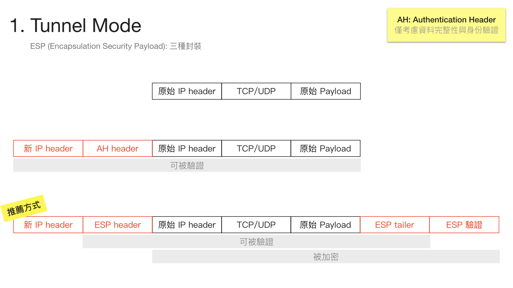
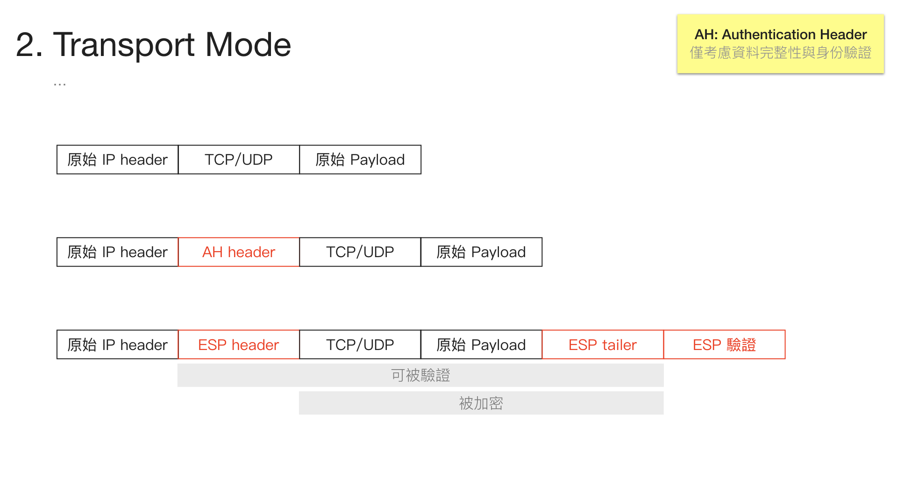

# VPN

- [VPN](#vpn)
  - [VPN Concept](#vpn-concept)
  - [GRE](#gre)
    - [實作](#%e5%af%a6%e4%bd%9c)
  - [IPsec](#ipsec)
    - [Features](#features)
    - [IKE (Internet Key Exchange)](#ike-internet-key-exchange)
    - [Encapsulation Format](#encapsulation-format)
    - [IPsec practice](#ipsec-practice)

## VPN Concept

- 目的：讓兩方私有網路的節點能進行通訊
- GRE（通用路由封裝協定）
  - 簡易，但未加密，安全性不足
  - 傳統的封包後面再串上 header
- IPSEC
  - SEC 代表 Security
  - 困難，有加密
  - 計算量較大，cost 較大
- 還有 GRE over IPSEC 與 IPSEC over GRE

## GRE

- 目的：多個私有網路中間隔著公共網路，想創建邏輯上的同個區網
- 特色
  - 簡易，但未加密，安全性不足
  - 傳統的封包後面再串上 header
  - 還支援廣播與群播，也支援在上面跑動態路由協議
- 私有 IP
  - 10.X.X.X
  - 172.16.X.X ~ 172.31.X.X
  - 192.168.X.X
  - 100.64.0.0（也是私有 IP）
- 透過隧道(Tunnel)技術，將原有的封包再包覆，接收時再還原
- GRE IP Protocol 數值為 47（ICMP:1, TCP: 6, UDP: 17）
- 無狀態協定，不提供流量控制
- GRE 至少增加 24 bytes cost
  - 20 bytes (IPv4 header) + 4bytes (GRE header)
- 具備多協定特性，可以將 IP 以及非 IP 封包封裝在隧道內
- **允許 multicast 流量和動態路由封包穿越隧道**
  - IPsec 無法達成此項功能
- 安全性較弱
- 用 IPv4 作為封裝時，protocol = 47

### 實作

> ref: [Jan Ho 的網絡世界 - Generic Routing Encapsulation (GRE) 通用路由封裝](https://www.jannet.hk/zh-Hant/post/generic-routing-encapsulation-gre/)

R1
```
ip route 192.168.2.0 255.255.255.0 172.16.12.2
```

R2
```
ip route 192.168.1.0 255.255.255.0 172.16.12.1
```

R3
```
ip route 192.168.1.0 255.255.255.0 172.16.13.1
```

R2
```
# R2 -> R3
ip route 192.168.3.0 255.255.255.0 172.16.12.1

# test
ping 192.168.3.3 source 192.168.2.2
```

R3
```
# R3 -> R2
ip route 192.168.2.0 255.255.255.0 172.16.12.1

# test
ping 192.168.2.2 source 192.168.3.3
```

```
clear ip route * # 清除動態路由表（不包含手工創建的靜態路由）

# 清除所有路由表（含動態與靜態）
show running-config # 先檢視所有路由表，並複製要清除的路由表
config
no ip route <路由表> # 刪除指定的路由表
```

TODO: 老師使用 RIP 協定，課本使用 EIGRP 協定

```
router rip
```

## IPsec

> ref: [Jan Ho 的網絡世界 - Internet Protocol Security (IPsec) 網際網路安全協定](https://www.jannet.hk/zh-Hant/post/internet-protocol-security-ipsec/)

### Features

1. 資料機密性 (Data Confidentiality)
   - 即使封包被擷取，也能避免內部資料外洩
   - 常用加密算法：DES, 3DES, AES (皆為對稱式加密方式，因為速度快)
     - Data Encryption System
     - Triple Data Encryption System
     - Advanced Encryption System
2. 資料完整性 (Data Integrity)
   - 常用算法：MD5, SHA-1
3. 身份驗證 (Authentication)
   - 確保對方的身份
   - 常用算法: 預共享密碼(Pre-shared key)和數位簽章(Digital Certificate)
4. 防重放攻擊 (Anti-replay attack)
   - IPsec 接收方可檢測並拒絕接收逾時或重複的封包

### IKE (Internet Key Exchange)

1. Phase 1: 建立一個安全通道，確保 **密鑰(key)** 能安全建立
2. Phase 2: 在 Phase 1 建立的安全通道之上，提供安全的 **資料(data)** 傳輸
    - Phase 1 與 Phase 2 可使用不同的加密算法，如 Phase 1 採用 DES、Phase 2 採用 AES。但一般多會採用相同的加密算法。

### Encapsulation Format

- 
- 

### IPsec practice

1. Intertesting
2. Phase 1
3. Phase 2
4. CMAP
5. use CMAP to corresponding port

- ISAKMP: Internet Service Association Key Management Protocol