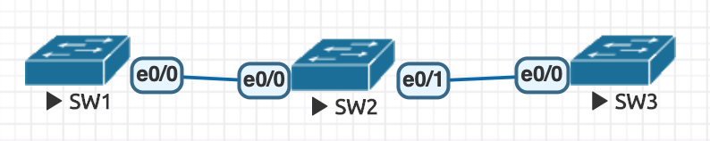
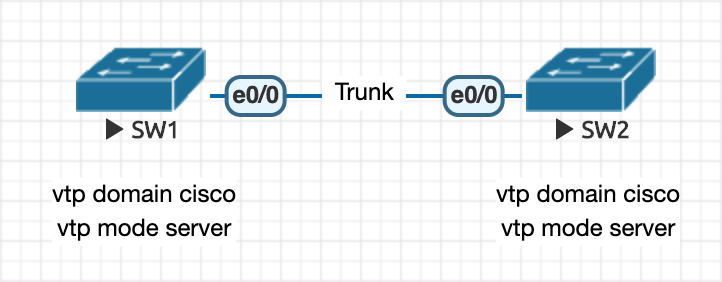
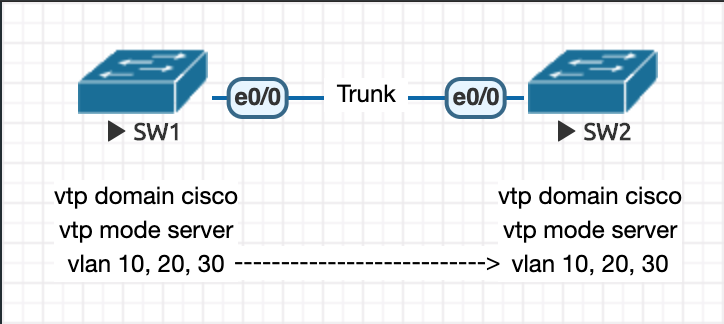
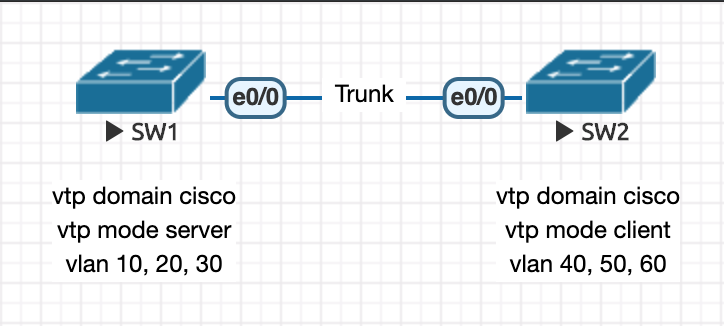

# VTP (VLAN Trunk Protocol)

- [VTP (VLAN Trunk Protocol)](#vtp-vlan-trunk-protocol)
  - [VTP Concept](#vtp-concept)
  - [VTP 模式](#vtp-%e6%a8%a1%e5%bc%8f)
  - [Experiment](#experiment)
    - [Step 1：基礎環境設置](#step-1%e5%9f%ba%e7%a4%8e%e7%92%b0%e5%a2%83%e8%a8%ad%e7%bd%ae)
    - [Step 2：在 SW1 新增 vlan 10, 20, 30](#step-2%e5%9c%a8-sw1-%e6%96%b0%e5%a2%9e-vlan-10-20-30)
    - [Step 3：關閉 SW2 e0/0 介面卡，並修改 SW2 的 vlan 設置](#step-3%e9%97%9c%e9%96%89-sw2-e00-%e4%bb%8b%e9%9d%a2%e5%8d%a1%e4%b8%a6%e4%bf%ae%e6%94%b9-sw2-%e7%9a%84-vlan-%e8%a8%ad%e7%bd%ae)
    - [Step 4：SW2 的 e0/0 介面重新連線](#step-4sw2-%e7%9a%84-e00-%e4%bb%8b%e9%9d%a2%e9%87%8d%e6%96%b0%e9%80%a3%e7%b7%9a)
    - [實驗結論](#%e5%af%a6%e9%a9%97%e7%b5%90%e8%ab%96)

## VTP Concept

- Cisco 私有技術
- 用於大量管理 vLAN 裝置（創建、刪除、修改）的協議
- 要先有 Trunk 模式，才能用 VTP 模式

## VTP 模式

1. Server：能創建、刪除、修改 vLAN
2. Client：不能創建、刪除、修改 vLAN，但能學習轉發
3. Transparent：能創建、刪除、修改 vLAN，不能學習轉發
   - 建議上線前先將自己的身份修改為 Transparent 模式，避免若為 Server 模式時，會影響當前網路環境甚至癱瘓

- 

SW1
```
enable
configure terminal
hostname SW1
vtp domain cisco
vtp password ccna
vtp mode server
do show vtp status
```

SW2
```
enable
configure terminal
hostname SW2
vtp domain cisco
vtp password ccna
vtp mode client
do show vtp status
```

SW3
```
enable
configure terminal
hostname SW3
vtp domain cisco
vtp password ccna
vtp mode client
do show vtp status
```

SW1
```
do show vlan brief
vlan 10
vlan 20
vlan 30
do show vlan brief
```

SW2
```
do show vlan brief # 此時不會看到 vlan 10, 20, 30，因為剛剛沒有設定 trunk，因此不會顯示
```

SW1
```
int e0/0
switchport trunk encapsulation dot1q
switchport mode trunk
```

SW2
```
int e0/0
switchport trunk encapsulation dot1q
switchport mode trunk
int e0/1
switchport trunk encapsulation dot1q
switchport mode trunk
```

SW3
```
int e0/0
switchport trunk encapsulation dot1q
switchport mode trunk
```

SW2
```
show vlan brief # 此時就會看到 vlan 10, 20, 30，因為設定好 Trunk 後會自動進行同步
```

## Experiment

### Step 1：基礎環境設置

> 註：這邊的 Switch 皆為 Layer 2 Switch（以下略）



```
// SW1
Switch>enable
Switch#configure terminal
Switch(config)#hostname SW1

SW1(config)#interface e0/0
SW1(config-if)#switchport trunk encapsulation dot1q
SW1(config-if)#switchport mode trunk
SW1(config-if)#vtp domain cisco
// vtp mode 預設為 server，因此不需特別設置


//SW2
Switch>enable
Switch#configure terminal
Switch(config)#hostname SW2
SW2(config)#interface e0/0
SW2(config-if)#switchport trunk encapsulation dot1q
SW2(config-if)#switchport mode trunk
SW2(config-if)#vtp domain cisco
SW2(config)#vtp mode client
```

### Step 2：在 SW1 新增 vlan 10, 20, 30



```
// SW1
SW1(config)#do show vlan brief
/* 此時 vlan 尚未設定
   確認 VTP Domain Name 是否為 cisco
   確認 VTP Operating Mode 是否為 Server
   確認 Configuration Revision 是否為 0 */

SW1(config)#vlan 10
SW1(config-vlan)#vlan 10
SW1(config-vlan)#do show vlan brief
/* 確認 vlan 10 有添加進去後，再進行下一步 */

SW1(config-vlan)#do show vtp status
/* 確認 Configuration Revision 是否為 1 */

SW1(config-vlan)#vlan 20
SW1(config-vlan)#vlan 20
SW1(config-vlan)#do show vlan brief
/* 確認 vlan 20 有添加進去後，再進行下一步 */

SW1(config-vlan)#vlan 30
SW1(config-vlan)#vlan 30
/* 確認 vlan 30 有添加進去後，再進行下一步 */

SW1(config-vlan)#do show vlan brief
/* 確認 vlan 10, 20, 30 皆為 active 狀態 */

SW1(config-vlan)#do show vtp status
/* 確認 VTP Doamin Name 為 cisco
   確認 Configuration Revision 為 3 */


// SW2
SW1(config-vlan)#do show vlan brief
/* 可以看到剛剛在 SW1 設定的 vlan 10, 20, 30 皆同步過來了

SW1(config-vlan)#do show vtp status
/* 可以看到 Configuration Revision 也同步過來，數值為 3
```

### Step 3：關閉 SW2 e0/0 介面卡，並修改 SW2 的 vlan 設置



```
// SW2
SW2(config)#interface e0/0
SW2(config-if)#shutdown // 先斷開連線，暫時不與 SW1 同步
SW2(config-if)#vtp mode server // 暫時更改模式為 Server，以修改 vlan 設定

SW2(config)#no vlan 10
SW2(config)#no vlan 20
SW2(config)#no vlan 30
SW2(config)#do show vtp status
/* 可以看到 Configuration Revision 數值為 6 */

SW2(config)#vlan 40
SW2(config-vlan)#vlan 40
SW2(config-vlan)#do show vlan brief
SW2(config-vlan)#vlan 50 
SW2(config-vlan)#vlan 50 
SW2(config-vlan)#do show vlan brief
SW2(config-vlan)#vlan 60
SW2(config-vlan)#vlan 60
SW2(config-vlan)#do show vlan brief
/* 確認 vlan 40, 50, 60 皆為 active 狀態 */

SW2(config-vlan)#vtp mode client // 更改模式回 Client
SW2(config)#do show vtp status
/* 確認 Configuration Revision 是否為 9 */


// SW1
SW1(config)#do show vtp status
/* 因為 SW2 的 e0/0 連線斷開而未同步，所以 Configuration Revision 的值仍為 3 */

SW1(config)#do show vlan brief
/* 同上原因，SW1 設定仍為 vlan 10, 20, 30 */
```

### Step 4：SW2 的 e0/0 介面重新連線


```
// SW2
SW2(config)#interface e0/0
SW2(config-if)#no shutdown // 啟用介面卡以重新連線來同步
SW2(config-if)#do show vtp status
/* Configuration Revision 仍為 9
   vtp mode 仍為 client */

SW2(config-if)#do show vlan brief
/* vlan 仍為 vlan 40, 50, 60 */


// SW1
SW1(config)#do show vtp status
/* Configuration Revision 變為 9 */

SW1(config)#do show vlan brief
/* vlan 變為 vlan 40, 50, 60 */
```


### 實驗結論

- 錯誤觀念：
  - 資料同步根據 VTP mode，Server 會傳遞給 Client
- 正確觀念：
  - 資料同步僅參考 Configuration Revision，數值越大代表資料越新。
  - VTP mode 僅代表能否修改 vlan 資料，Server 能、Client 不能。