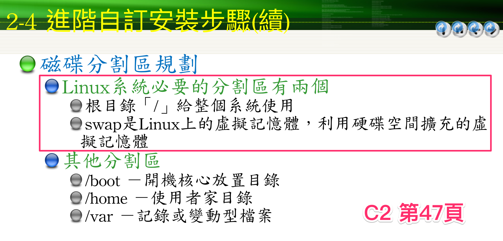

# C1 Linux 介紹
## 圖形管理介面
* Gnome
* KDE

## 發行版本(Distribution)
* 包括安裝、驅動、工具與軟體的集合
* CentOS : 伺服器運維、安裝與管理 (課程中採用)
    * 優點 : 穩定版會維護十年，相較於 Ubuntu 只有五年維護期，而 RedHat 則是以偏向商業化
    * CentOS 7.0 為一個分界點，之後的版本都只有 64-bit 版本
* Fedora : 相較於 CentOS 多了很多新功能，但較不穩定
* Kali Linux : 以 Ubuntu 為基底，駭客常用
* Ubuntu 雖然 UI 好看，但不太適合架站
* 最新的版本不一定最好，因為可能不夠穩定

## 自由軟體
* 自由軟體≠免費軟體
### 授權
* Linux 多採用 GNU 授權，可以使用其他人的程式，但一旦採用就需要將自己的原始碼公開出來
* Apache 授權較為寬鬆，使用他人程式並不用釋放自己的程式碼
    * 全文：當軟體使用 Apache 授權時，重新散佈或修改程式碼後，不一定要提供原始程式碼

# C2 Linux 安裝
* 映像檔有 i386 名稱代表 32 位元版本
* x64 代表 64 位元版本
* CitriX：?
* Linux 切割時至少要有兩個分割區，根目錄(/)與 swap 分割區(**段考,期中必考**)
* 
* Swap 通常設定記憶體的 1 ~ 1.5 倍
* home 資料夾(/home)通常會放到獨立的位置
* var 資料夾(/var)要開大一點

# C3 Linux 的操作
## 命令提示符號(必考)
* `#`：超級使用者
* `$`：一般使用者
* BIOS：Basic Input Output System
* MBR(Master Boot Record)
* Bootloader：硬碟在啟動後，選擇要啟動哪一個分割區的作業系統
* GRUB：系統啟動軟體
    * 可利用 GRUB 進入單人模式，進行系統的修復
	* runlevel 1：單人模式（能用來修改 root 密碼）(=sysinit.target)
    * runlevel 3：文字模式(=multi-user.target)
    * runlevel 5：GUI(=graphical.target)
* 核心(kernel)：與硬體、BIOS溝通的複雜程式
    * 現今核心多為 2 或 3 版
    * 最新版本會增加功能，但可能較不穩定
* 早期的系統，第一支程式為 init，現今為 systemd (process id = 1)
    * 為什麼要改用 systemd？
    * 早期：原本開機是 waterfall 模式，現今是 synchronize(同步) 執行伺服器，更有效率
* 更改 root 密碼
    * [How to change root password centos](https://www.youtube.com/watch?v=ZeuiO8fM7GM)
* 虛擬終端/虛擬主控臺(virtual console)
    * 當 GUI 介面掛掉的時候，可以改用虛擬終端輸入指令
    * ctrl + option + fn + f1：圖形介面
    * ctrl + option + fn + f3：文字介面

# 指令
* `sudo halt -P, --poweroff`：關機
* `sudo halt -r, --reboot`：重新開機
* `sudo halt --halt`：暫停
### 若不能使用 sudo 時（代表沒有超級使用者身份）
1. 輸入 `su`，先切換到超級使用者
2. `gedit /etc/sudoers`
3. 在 Allow root to run any commands anywhere 處新增 `userName    ALL=(ALL)    ALL`
    * gedit 類似 windows 上的 notepad

# 雜記
* 做專題可以考慮新增「行動支付」功能
* 智慧家居
    * WeMo 智慧型插座
* [企業無線網路 (WLAN) | Aruba, a Hewlett Packard Enterprise company](http://www.arubanetworks.com/zh-hant/products/networking/)
    * 已被 HP 收購
    * 著重於 Fit AP
* 基地台分為兩種
    * Fit/thin AP(瘦AP)：適合企業大量部署，機器本身功能不多，但能用一台終端同時管理多台裝置
    * FAT/thick AP(胖AP)：提供所有功能在一台機器上，通常用於家用
* IOT 識別
    * 辨識物聯網裝置是什麼類型，藉以避免授予裝置未知的權限，讓裝置做有害的攻擊
    * 如：讓 webcam 發送 E-mail
    * 因為物聯網裝置通常不會做防護（如安裝防毒軟體），代表容易暴露在危險之中
    * 專業術語：「DHCP fingerprint」
    * [GitHub - karottc/fingerbank: DHCP fingerprints database and related tools](https://github.com/karottc/fingerbank)
<!--stackedit_data:
eyJoaXN0b3J5IjpbLTE4ODc4MjE2NzldfQ==
-->