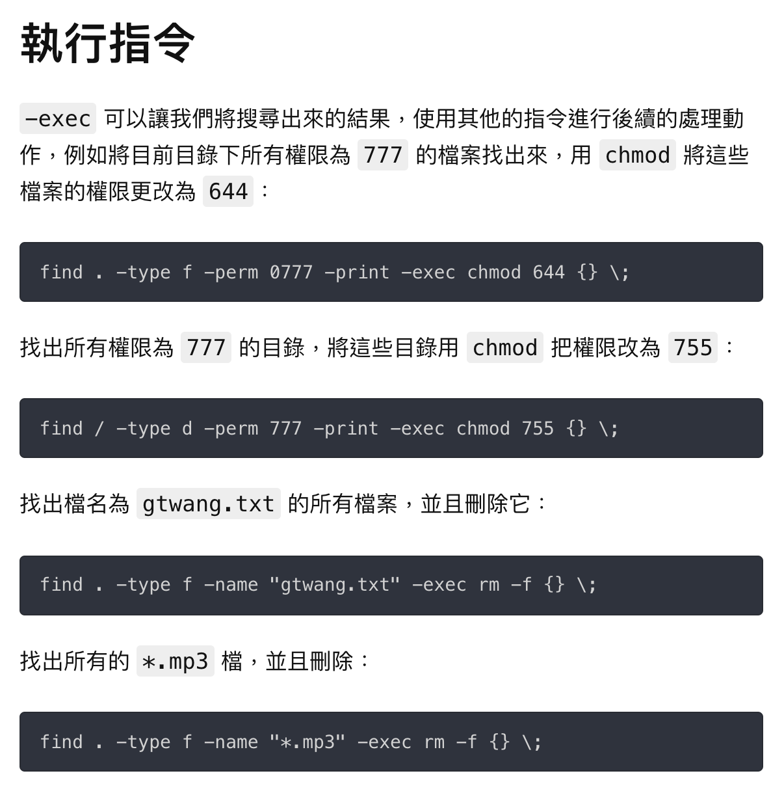

# 雜記
* 考第 1 ~ 5 章
    * 70 ~ 80% : 課本內習題
    * 10 ~ 20% : MOOC, 課外內容
* chattr [選項] [檔案名]
    * chattr : change attribute
    * `+` : 增加權限
    * `-` : 減少權限
    * i 選項
        * 文件 : 不能新增、修改、刪除
        * 目錄 : 只能修改目錄下文件，但不能建立與刪除文件
    * a 選項 : append
        * 文件 : 只能新增；不能修改、刪除
        * 目錄 : 只能建立、修改文件，但不能刪除文件
        * a 選項的文件雖然不能直接用 vim 修改，但能透過 `echo <插入的文字> >> <檔案名稱>`

-   |i選項(文件)|i選項(目錄)|a選項(文件)|a選項(目錄)
-   |-         |-        |-         |-
新增 |X         |X        |O         |O
修改 |X         |O        |X         |O
刪除 |X         |X        |X         |X

* lsattr : 查看權限
    * -d 選項(directory) : 顯示目錄的屬性
    * 如果沒有加 `-d`，則會顯示目錄內的檔案
    * 應用 : 如果有時候檔案不能夠修改或刪除，可以輸入 `lsattr` 指令查看權限，看看是否有 a、i 權限以致於無法修改、刪除。
* 用以下指令能生成名為當前日期的檔案

```bash
$ touch `date +%Y-%m-%d`
$ ls
2018-04-09
```
* `netstat -tulnp`
    * netstat : 查詢系統連線狀態
    * t : tcp
    * u : udp
    * l : listen
    * n : 不解析
    * p : process
    * 註 : windows 上使用 `netstat -an`
* 本機位址 0.0.0.0 : 代表本機上任意界面的 IP 位址
    * 也會用在 DHCP 上(電腦尚未開機時，用 0.0.0.0 代表)
* wc : word count
* xargs
```bash
$ echo {1..4}
1
2
3
4
$ echo {1..4} | xargs -n 2
1 2
3 4
```
* tee : read from standard input and write to standard output and files
```bash
# whoami
root
# whoami > whoamifile
# whoami | tee whoamifile
root
# cat whoamifile
root
```

### atime, ctime, mtime
* atime(Access time)：檔案上次被讀取的時間。
    * 最敏感
* ctime(status Change time)：檔案的屬性或內容上次被修改的時間。
* mtime(Modified time)：檔案的內容上次被修改的時間。
* 參考 : [maxubuntu.blogspot.com/2009/11/ctime-atimemtime.html](http://maxubuntu.blogspot.com/2009/11/ctime-atimemtime.html)

### find
* 
* 尋找空白檔案
    * `find . -type f -empty`
    * 或 `find . -type f -name ".*"`
* 參考 : [Unix/Linux 的 find 指令使用教學、技巧與範例整理 - G. T. Wang **（考試可能會考）**](https://blog.gtwang.org/linux/unix-linux-find-command-examples/)