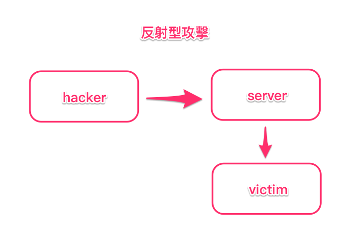
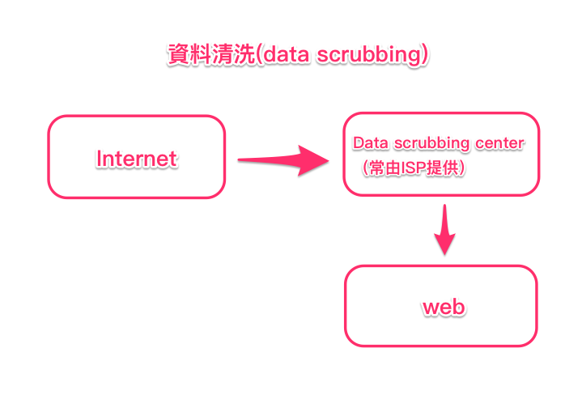

# C6
* Linux 萬物皆為檔案
* 自動掛載
    * `/etc/fstab` 能控制下次開機的掛載區
    * 參考 : [鳥哥的 Linux 私房菜 -- 第七章、Linux 磁碟與檔案系統管理](http://linux.vbird.org/linux_basic/0230filesystem.php#fstab)

# 雜記
* 公司有以下這些職位：
    * dev : development
    * op : operation
    * sec : security
* EU GDPR（歐盟個人資料保護規則）
    * 全名 : European Union General Data Protection Regulation
    * 談到關於個資
    * 如果公司將資料洩漏出去，會有很重的罰金
* 常見網路攻擊
    1. 反射性攻擊
        * 
    2. 放大型攻擊 : 將傳送的封包放大後回傳
    3. 資料清洗(data scrubbing)
        * data scrubbing center 會對資料進行處理，確保傳送的資料正確
        * 
    4. WAF : Web Application Firewall
    5. DAF : Database Application Firewall
    6. SQL injection : 
    7. XSS : cross-site script
    * 第 6, 7 種攻擊很常見
* dmesg = dump message