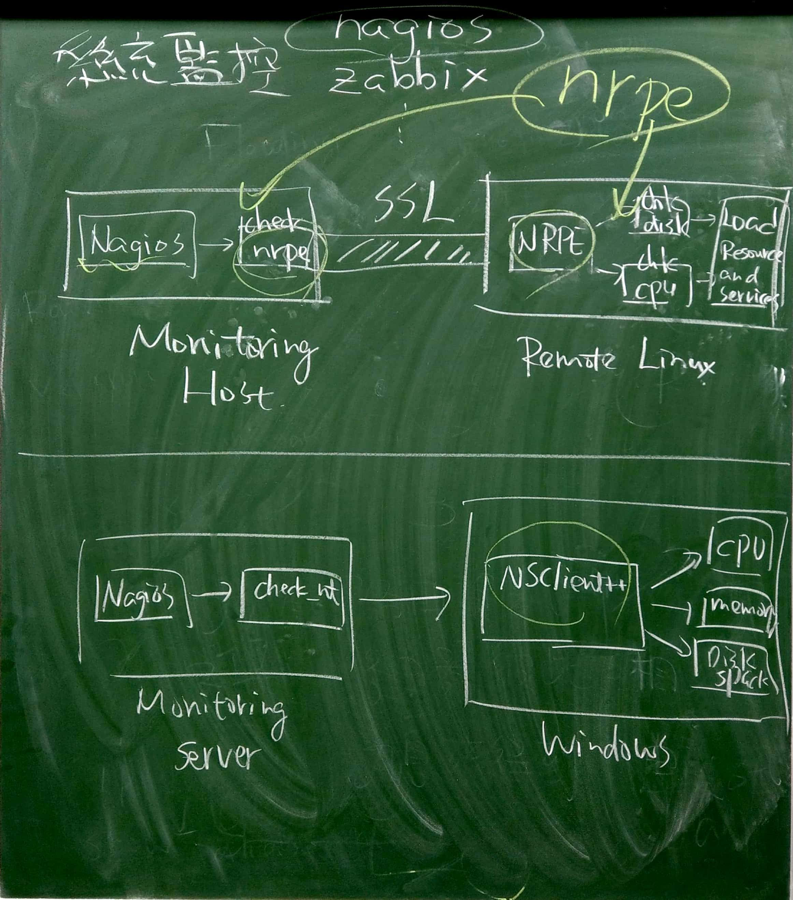

- [雜記](#%E9%9B%9C%E8%A8%98)
- [系統監控](#%E7%B3%BB%E7%B5%B1%E7%9B%A3%E6%8E%A7)
  - [目的](#%E7%9B%AE%E7%9A%84)
  - [配置圖與環境設置](#%E9%85%8D%E7%BD%AE%E5%9C%96%E8%88%87%E7%92%B0%E5%A2%83%E8%A8%AD%E7%BD%AE)
  - [常見工具](#%E5%B8%B8%E8%A6%8B%E5%B7%A5%E5%85%B7)
- [nagios](#nagios)
  - [直接監控 安裝過程與測試](#%E7%9B%B4%E6%8E%A5%E7%9B%A3%E6%8E%A7-%E5%AE%89%E8%A3%9D%E9%81%8E%E7%A8%8B%E8%88%87%E6%B8%AC%E8%A9%A6)
    - [排錯](#%E6%8E%92%E9%8C%AF)
  - [nagios-plugins](#nagios-plugins)
  - [間接監控 安裝與測試](#%E9%96%93%E6%8E%A5%E7%9B%A3%E6%8E%A7-%E5%AE%89%E8%A3%9D%E8%88%87%E6%B8%AC%E8%A9%A6)
- [參考資料](#%E5%8F%83%E8%80%83%E8%B3%87%E6%96%99)

---

# 雜記
* 上週的內容請自行完成
* 負載均衡器除了能用 LVS，還可以用 Keepalived
* 老師電腦環境配置：
  * 主控端機器：7.0-1；IP：192.168.56.10**3**
  * 被控端機器：7.0-2；IP：192.168.56.10**2**

# 系統監控
## 目的
* 管理大量的電腦

## 配置圖與環境設置

* 若主控端與被控端都是 Linux（圖上半部），雙方都需安裝  `nrpe`
* 若主控端為 Linux, 被控端為 Windows（圖下半部）， 被控端要安裝 `NSClock++`
* 兩台機器，皆設置為 NAT + Host-only
* 筆者電腦環境配置：
  * 主控端機器：centos test2 (RS1)；IP：192.168.56.10**2**
  * 被控端機器：centos test2 (RS2)；IP：192.168.56.10**4**

## 常見工具
* nagios（今天的主題）
  * 有分成伺服器與客戶端
  * 伺服器：一般都是在 Linux 上
  * 客戶端：可在 Linux 與 Windows 上查看
* zabbix

# nagios
* 有分成兩種監控模式：
  1. [直接監控](#%E7%9B%B4%E6%8E%A5%E7%9B%A3%E6%8E%A7-%E5%AE%89%E8%A3%9D%E9%81%8E%E7%A8%8B%E8%88%87%E6%B8%AC%E8%A9%A6)
     * 不需要客戶端的軟體，用一些簡單的方式去判斷，但也只能掌握基本的資訊
     * 可透果主機是否 alive 或 server 是否有成功執行判斷（例如透過 ping 來測試主機是否上線中）
  2. [間接監控](#%E9%96%93%E6%8E%A5%E7%9B%A3%E6%8E%A7-%E5%AE%89%E8%A3%9D%E8%88%87%E6%B8%AC%E8%A9%A6)
     * 週期性（固定一段時間）去抓取，能掌握 CPU、硬碟空間、記憶體等較詳細的資訊
     * 如 NRPE(Nagios Remote Plugin Executor)
     * 可參考：[nagios + nrpe 監控遠端 Linux 主機的CPU或硬碟空間 | SSORC.tw](https://ssorc.tw/1122)

## 直接監控 安裝過程與測試


1. Server 上輸入以下指令安裝相關套件：
```
yum install epel-release # 安裝第三方軟體資料庫
yum install httpd nagios* nrpe
systemctl start httpd
systemctl start nagios
htpasswd -c /etc/nagios/passwd nagiosadmin
systemctl restart httpd
systemctl restart nagios
```

2. 接著進入管理端介面查看是否建置成功
   * 管理端 IP：`主控端IP/nagios`，如 `192.168.56.102/nagios`
   * 帳號：nagiosadmin
   * 密碼：輸入 `htpasswd -c /etc/nagios/passwd nagiosadmin` 所設定的密碼（這邊筆者設定為 `centos`）

3. 再編輯配置檔
   * 註：nagios 設定檔位置：`/etc/nagios`
```
cd /etc/nagios/objects
vim localhost.cfg
```

4. 複製定義當作範本
```
# Define a host for the local machine

define host {

    use                     linux-server            ; Name of host template to use
                                                    ; This host definition will inherit all variables that are defined
                                                    ; in (or inherited by) the linux-server host template definition.
    host_name               localhost
    alias                   localhost
    address                 127.0.0.1
}
```

5. 貼上一份並修改 host_name, alias, address
```
# Define a host for the local machine

define host {

    use                     linux-server            ; Name of host template to use
                                                    ; This host definition will inherit all variables that are defined
                                                    ; in (or inherited by) the linux-server host template definition.
    host_name               web1
    alias                   web1
    address                 192.168.56.104
}
```

6. 重啟 Nagios
```
systemctl restart nagios
```

7. 查看 nagios 管理端介面是否多了 web1

### 排錯
* 如果在 Host 頁面下連 localhost 都不能 ping 的話，且出現以下問題：
```
(No output on stdout) stderr: execvp(/usr/lib64/nagios/plugins/check_ping, ...) failed. errno is 2: No such file or directory
```
* 可透過安裝 Nagios 相關套件來排除：
```
yum install -y nagios-plugins*
```
* 參考：[Missing Nagios plugins in CentOS 7 – The Accidental Developer](https://osric.com/chris/accidental-developer/2016/12/missing-nagios-plugins-in-centos-7/)

## nagios-plugins
* `rpm -qa | grep nagios-plugins`：查看 nagios plugins 列表
* `rpm -ql nagios-plugins-http`：查看 nagios-plugins-http 檔案位置
  * 註：會印出`/usr/lib64/nagios/plugins/check_http`
* `./check_http -I 192.168.56.104 -p 80`：測試是否能在 80 port 連接到 192.168.56.104 (主控端)
* `./check_ssh 192.168.56.104`：測試是否能透過 ssh 連接到


## 間接監控 安裝與測試
* 在被控端上輸入：
```sh
yum install epel-release nrpe nagios-plugins*
vim /etc/nagios/nrpe.cfg # 新增 allow-hosts 127.0.0.1, 192.168.56.102 (主控端 IP)
systemctl start nrpe
```
* `cat /etc/nagios/nrpe.cfg`：可查看 __
* `gedit /etc/nagios/objects/commands.cfg`
```
define command {
    command_name    check_nrpe
    command_line    $USER1/check_nrpe -H $HOSTADDRESS$ -c $ARG1$
}
```
* 說明：
  * `$USER1`：對應到 __

* `gedit /etc/nagios/objects/localhost.cfg`
```
define service {
    use                     local-service
    host_name               web1
    service_description     check users
    check_command           check_nrpe!check_users
    notifications_enabled   0

}
```

# 參考資料
* [系統監看工具Nagios簡易安裝教學 - 行政院國家資通安全會報技術服務中心](http://www.nccst.nat.gov.tw/ArticlesDetail?lang=zh&seq=1106)