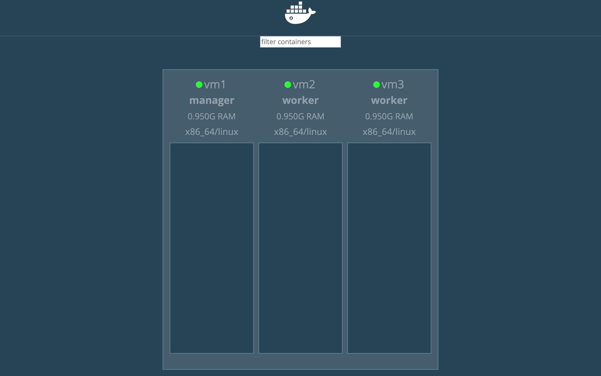

# Docker Swarm (Cluster)

- [Docker Swarm (Cluster)](#docker-swarm-cluster)
  - [1. Set up environment](#1-set-up-environment)
    - [set hostname & start ssh service](#set-hostname--start-ssh-service)
    - [set ip](#set-ip)
    - [ssh with password](#ssh-with-password)
  - [2. install the necessary images](#2-install-the-necessary-images)
  - [3. Initialize Docker Swarm](#3-initialize-docker-swarm)
    - [移除 worker in docker swarm](#%e7%a7%bb%e9%99%a4-worker-in-docker-swarm)
    - [Docker Node](#docker-node)
      - [顯示加入 Node 的指令](#%e9%a1%af%e7%a4%ba%e5%8a%a0%e5%85%a5-node-%e7%9a%84%e6%8c%87%e4%bb%a4)
      - [升級、降級權限](#%e5%8d%87%e7%b4%9a%e9%99%8d%e7%b4%9a%e6%ac%8a%e9%99%90)
      - [顯示目前所有的 service](#%e9%a1%af%e7%a4%ba%e7%9b%ae%e5%89%8d%e6%89%80%e6%9c%89%e7%9a%84-service)
      - [查看 web 服務的任務](#%e6%9f%a5%e7%9c%8b-web-%e6%9c%8d%e5%8b%99%e7%9a%84%e4%bb%bb%e5%8b%99)
      - [擴展 web 服務](#%e6%93%b4%e5%b1%95-web-%e6%9c%8d%e5%8b%99)
      - [讓 vm1(manager) 只進行分配，不執行任務](#%e8%ae%93-vm1manager-%e5%8f%aa%e9%80%b2%e8%a1%8c%e5%88%86%e9%85%8d%e4%b8%8d%e5%9f%b7%e8%a1%8c%e4%bb%bb%e5%8b%99)
      - [移除 web 服務](#%e7%a7%bb%e9%99%a4-web-%e6%9c%8d%e5%8b%99)
    - [執行 web 服務（有 2 個 replicas）](#%e5%9f%b7%e8%a1%8c-web-%e6%9c%8d%e5%8b%99%e6%9c%89-2-%e5%80%8b-replicas)
    - [進入](#%e9%80%b2%e5%85%a5)
  - [雜記](#%e9%9b%9c%e8%a8%98)

- 可以的話開 3 台機器，不行的話至少開 2 台
- 將三台設置不同的名稱，並透過 ssh 無密碼連線

## 1. Set up environment

### set hostname & start ssh service

- vm1, vm2, vm3

```
hostnamectl set-hostname vm1
systemctl start sshd
```

### set ip

- vm1 file: `/etc/hosts`

```
<IP1> vm1 # IP = 172.168.45.128
<IP2> vm2 # IP = 172.168.45.132
<IP3> vm3 # IP = 172.168.45.133
```

### ssh with password

- vm1

```
ssh-keygen
ssh-copy-id root@vm2
ssh-copy-id root@vm3

# test
ssh root@vm2
ssh root@vm3

scp /etc/hosts vm2:/etc/hosts
scp /etc/hosts vm3:/etc/hosts
```

## 2. install the necessary images

- vm1, vm2, vm3

```
docker pull httpd:latest
docker pull httpd:alpine
```

- vm1

```
docker pull dockersamples/visualizer
```

## 3. Initialize Docker Swarm

- 初始化 Docker Swarm

```
docker swarm init --advertise-addr 172.16.45.128
```

- 輸入完上面的指令後，會出現成為此 swarm worker 的指令（如下），並將以下指令在 vm2, vm3 執行

```
docker swarm join --token SWMTKN-1-41lcdnvlm8fz5alhvva9sdaeb400xn19s94dqs11kf8n2waajy-6notsx81h0lu4dt7m4fr5ef0y 172.16.45.128:2377
```

- 在新增完 worker 之後，可輸入以下指令查看 Docker swarm 的成員

```
[root@localhost user]# docker node ls
ID                            HOSTNAME            STATUS              AVAILABILITY        MANAGER STATUS      ENGINE VERSION
ji75600ybrwqg1kk2maxun3yi *   vm1                 Ready               Active              Leader              19.03.4
uum9t4buvb54m9nku9c6ido5f     vm2                 Ready               Active                                  19.03.4
zk8o4v20ubm73phergzgkdk2d     vm3                 Ready               Active                                  19.03.4
```

- run `dockersamples/visualizer` image

```
docker run -itd -p 8888:8080 -e HOST=172.16.45.128 -e PORT=8080 -v /var/run/docker.sock:/var/run/docker.sock --name visaulizer dockersamples/visualizer
```

- 在瀏覽器中至 `<VM1_IP>:8888` 查看 Visualizer 頁面
  - 

### 移除 worker in docker swarm

- vm2, vm3

```
docker swarm leave
```

- 若要讓 manager(vm1) 離開 node，則需要加上 `--force`

```
docker swarm leave --force
```

### Docker Node

#### 顯示加入 Node 的指令

- vm1

```
docker swarm join-token worker
docker swarm join-token manager
```

#### 升級、降級權限

- vm1

```
docker node demote <ID> # Leader -> Worker
docker node promote <ID> # Leader <- Worker
```

- 啟動一個名為 web 服務，使用 httpd image
- vm1

```
docker service create --name web httpd
```

#### 顯示目前所有的 service

- vm1

```
docker service ls
```

#### 查看 web 服務的任務

- vm1

```
docker service ps web
```

#### 擴展 web 服務

- vm1

```
docker service scale web=3
```

#### 讓 vm1(manager) 只進行分配，不執行任務

- vm1

```
docker node update --availability drain vm1
```

- 若要再讓 vm1 再次執行任務，可以將狀態由 `drain` 改回 `active`

```
docker node update --availability active vm1
```

#### 移除 web 服務

```
docker service rm web
```

### 執行 web 服務（有 2 個 replicas）

```
docker service create --name web --replicas 2 httpd
```

### 進入

```
docker ps
docker exec -it web.2
```

```
docker service create --name web --replicas 2 -p 5555:80 httpd:latest
```

- 就算 service 只跑在 vm1 與 vm2，但透過 vm3 仍然能夠連線上去

- 如果一開始我們沒指定 port，可透過

```
docker service create --name web --replicas 2 httpd:latest

docker service update --publish-add 5555:80 web
```

- 可透過 `docker inspect` 查看 IP
- 或透過以下指令

```
docker run -it --network container:<DockerNames> busybox sh
# 進去後再執行 ifconfig
```

## 雜記

- 術語
  - 水平擴充（新增更多機器）
  - 垂直擴充（本機升級硬體）
- 下週會再進行詳解網路架構
- 會再解釋 rollback
- 先準備 Ubuntu * 3 台虛擬機（一定要 3 台）