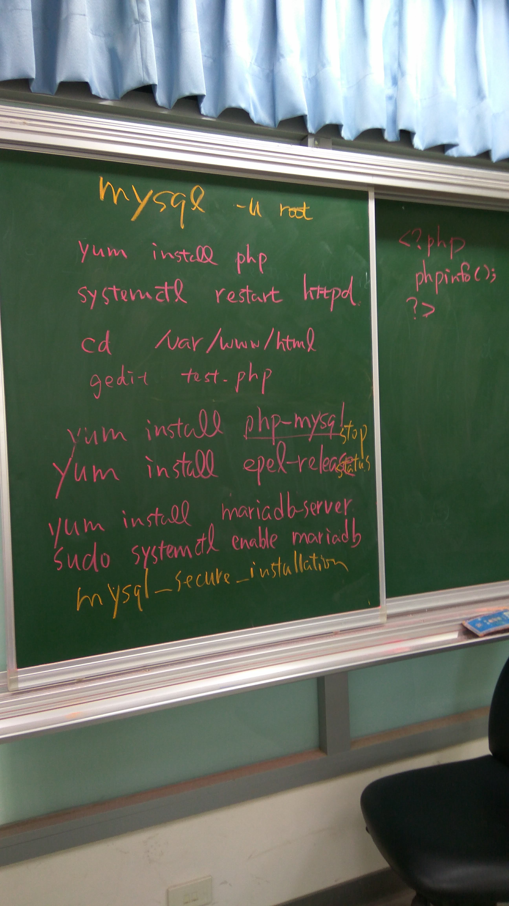
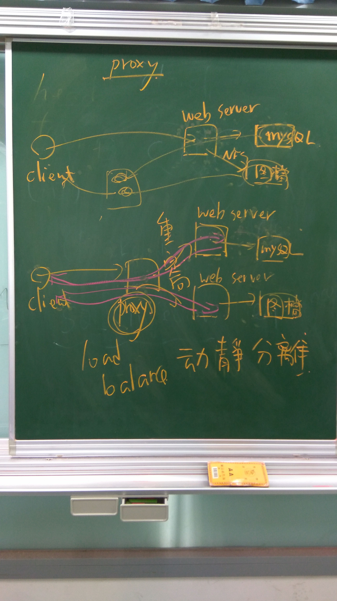

# 雜記
* 使用 TCP 協定傳輸雖然可靠，但缺點是效能較差，會浪費七個封包
* 下一代網路傳輸協定：HTTP/3，改採用 UDP 的協定
* 目前 HTTP 最新版本為 v1.3，該如何知道當前的版本呢？A:抓封包
    * 常見為 v0.9, v1.0, v1.1，最常見為 v1.1
* 如果網路不能通訊時，可以透過如 WireShark 等抓封包程式來除錯
* 如果封包寄出，接收端也成功收到，但應用層卻沒有接收到的話，可能是 checksum 沒有驗證的問題(Validation Disabled)
    * 因此建議開啟 WireShark 偏好設定中的 validate the IP/TCP checksum if possible 選項

## 15-2 Linux 的安全防護機制
* 有兩種：
    1. 防火牆 FirewallD
    2. 增強安全機制 Security Enhanced Linux, SELinux
* SELinux 目前只有在 CentOS, Fedora 中存在；Ubuntu 中沒有，因此目前先建議關閉，等之後熟練後再使用

## 15-3 安裝 Apache
* 查看客戶端的連接資訊（如IP、來源網站、時間、GET/POST、HTTP 版本與狀態碼、瀏覽器）
    * `-f` 選項為 follow，會動態更新
    * 能透過這些資訊分析（如熱門網頁、用戶地區分佈），或者是否有被攻擊
    * IP 能透過 `nslookup` 能反查使用者的國家
```shell
tail -f /var/log/httpd/access_log
```

* 在 ubuntu 或 docker 中若要啟動 apache 服務，可輸入
* start 可替換成 stop/restart(關閉/重啟)
```shell
/etc/init.d/apache2 start
```

## 15-4 啟動 Apache

## 15-5 Apache 的基本設定
* 網頁伺服器會同時有許多行程在執行，以提升效能

```shell
sudo yum -y install epel-release
sudo yum -y install mariadb-server # 安裝資料庫伺服器
sudo systemctl enable mariadb
sudo systemctl start mariadb
sudo systemctl status mariadb
sudo mysql_secure_installation # 遠端進行連線
mysql -u root # 即可登入

rpm -qa | grep php
sudo yum -y install php
```
* EPEL：Extra Packages for Enterprise Linux

#### MySQL Server(MariaDB)
* SQL server 跑在 port 3306
* 可參考：[CentOS Linux 7 安裝 MySQL/MariaDB 資料庫教學 - G. T. Wang](https://blog.gtwang.org/linux/centos-7-install-mariadb-mysql-server-tutorial/)
* TODO：補上實作的程式碼
* 
* 

### 動靜分離
* 透過 Proxy 的協助，以達成負載均衡(load balance)的效果，能降低伺服器中的負擔
* 補充：Proxy 有分靠近使用者與靠近伺服器端，動靜分離屬於靠近伺服器端的那類
* 
* 若要瞭解更多，可參考[重定向和伪静态在网站中的应用-慕课网](https://www.imooc.com/learn/798)