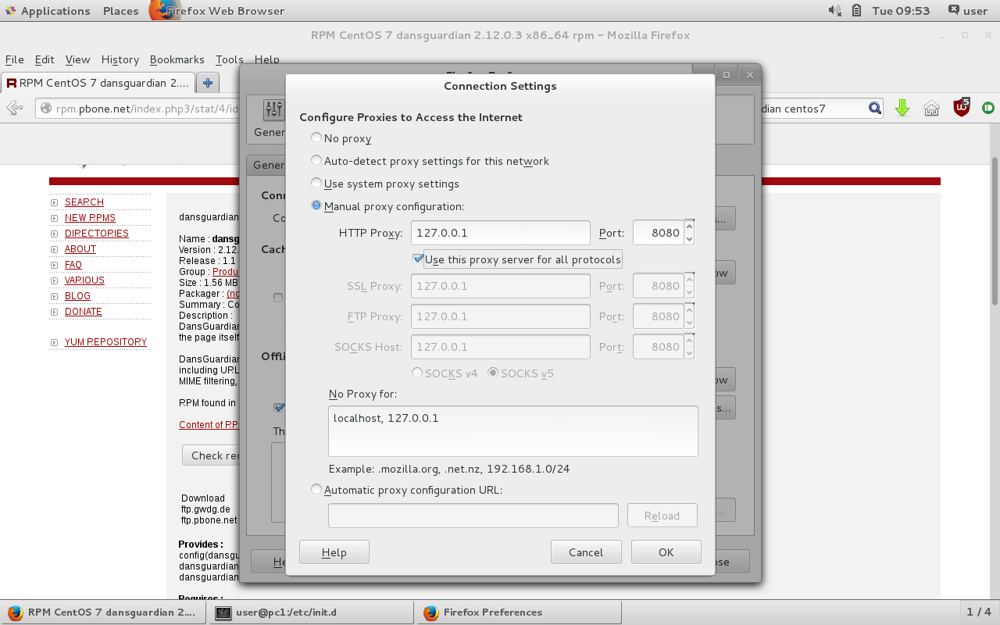

## DansGuardian
* 相較於 Squid 只能過濾 URL，DansGuardian 還能過濾關鍵字、限制不能下載指定類型的檔案（如PDF）
* 偏向應用層的封鎖

## 下載並安裝
* 先下載 [DandGuardian 的 RPM 安裝檔](ftp://ftp.pbone.net/mirror/ftp5.gwdg.de/pub/opensuse/repositories/home:/Kenzy:/packages/CentOS_7/x86_64/dansguardian-2.12.0.3-1.1.x86_64.rpm)
* 透過 rpm 指令安裝
```
[root@pc1 Downloads]# rpm -ivh dansguardian-2.12.0.3-1.1.x86_64.rpm 
warning: dansguardian-2.12.0.3-1.1.x86_64.rpm: Header V3 DSA/SHA1 Signature, k
 ID a9d6e8ec: NOKEY
Preparing...                          ################################# [100%]
Updating / installing...
   1:dansguardian-2.12.0.3-1.1        ################################# [100%]
```
## 參數設定
```shell
vim /etc/dansguardian/dansguardian.conf
```
#### 改成中文
* 正體中文：`language="chinesebig5"`
* 簡體中文：`language="chinesegb2312"`

#### 補充：上禮拜的 Squid 在 3128 port
```shell
systemctl start squid # 啟動 Squid
netstat -tunlp | grep squid # 查看 Squid 的埠號
```

#### 確認防火牆有沒有關閉
```shell
systemctl status firewalld
systemctl stop firewalld # 如果沒有關閉，須關閉
```

#### 啟動 DansGuardian
```shell
systemctl start dansguardian # 錯誤，不能用 systemctl 方式開啟

# 也能直接寫 ./etc/init.d/dansguardian
cd /etc/init.d
./dansguardian start
```

#### 設定瀏覽器的 HTTP Proxy 為 127.0.0.1, Port 為 8080
* 注意 `Use this proxy server for all protocols` 需打勾


#### 封鎖清單
```shell
cd /etc/dansguardian/lists/
vim bannedsitelist # 過濾指定網域清單
vim bannedphraselist # 過濾關鍵字清單
```

> 設定完需重新啟動 DandGuardian
```shell
./etc/init.d/dansguardian restart
```

## DHCP Server
#### 虛擬機網路介面卡設定
* TODO : 補上網路配置的圖片（照相）
* 第一台機器設定為 NAT, 內部網路
* 第二台機器只有設定為內部網路（因此無法取得 IP)
* 所有的內部網路中，混合模式需設定為允許全部

#### 目前第二台機器不能連上網路，因此第一台機器需設定：
1. 啟動路由
```shell
echo 1 > /proc/sys/net/ipv4/ip_forward
cat /proc/sys/net/ipv4/ip_forward # 應該要顯示 1
```
2. 配置 NAT
    * -s : source
    * -o : output
    * MASQUERADE : 
```shell
iptable -t nat --append POSTROUTING -s 192.168.10.0/24 -o enp0s3 -j MASQUERADE
```
* 現在第二台機器也能上網了！
---
* 第二台的設定
    * brd：支援 broadcast
```shell
ip addr add 192.168.10.254 brd + dev enp0s8
ping 192.168.10.254 # 測試上面是否設定成功
```

* 能看到在做完 `ip addr add 192.168.10.254 brd + dev enp0s8` 後， enp0s8 的 inet  為我們設定的 `192.168.10.254`
```shell
[user@pc1 ~]$ ifconfig
enp0s3: flags=4163<UP,BROADCAST,RUNNING,MULTICAST>  mtu 1500
# 省略

enp0s8: flags=4163<UP,BROADCAST,RUNNING,MULTICAST>  mtu 1500
        inet6 fe80::a00:27ff:fe65:10fa  prefixlen 64  scopeid 0x20<link>
        ether 08:00:27:65:10:fa  txqueuelen 1000  (Ethernet)
        RX packets 287  bytes 17220 (16.8 KiB)
        RX errors 0  dropped 0  overruns 0  frame 0
        TX packets 25  bytes 5622 (5.4 KiB)
        TX errors 0  dropped 0 overruns 0  carrier 0  collisions 0

lo: flags=73<UP,LOOPBACK,RUNNING>  mtu 65536
# 省略

[user@pc1 ~]$ sudo ip add add 192.168.10.254 brd + dev enp0s8
[sudo] password for user: 
[user@pc1 ~]$ ifconfig
enp0s3: flags=4163<UP,BROADCAST,RUNNING,MULTICAST>  mtu 1500
# 省略

enp0s8: flags=4163<UP,BROADCAST,RUNNING,MULTICAST>  mtu 1500
        inet 192.168.10.254  netmask 255.255.255.255  broadcast 0.0.0.0
        inet6 fe80::a00:27ff:fe65:10fa  prefixlen 64  scopeid 0x20<link>
        ether 08:00:27:65:10:fa  txqueuelen 1000  (Ethernet)
        RX packets 304  bytes 20382 (19.9 KiB)
        RX errors 0  dropped 0  overruns 0  frame 0
        TX packets 36  bytes 8331 (8.1 KiB)
        TX errors 0  dropped 0 overruns 0  carrier 0  collisions 0

lo: flags=73<UP,LOOPBACK,RUNNING>  mtu 65536
# 省略
```

#### 安裝 DHCP Server
```shell
sudo yum install -y dhcp-devel
```

#### 修改設定檔
```shell
vim /etc/dhcp/dhcpd.conf
```
* 新增以下內容
    1. 內部網路為`192.168.10.0`，網路遮罩`255.255.255.0`
    2. 內定路由器：`192.168.10.254`
    3. 網路遮罩：`255.255.255.0`
    4. DNS：`8.8.8.8, 9.9.9.9`
    5. 設定的 IP 範圍：`192.168.10.100` ~ `192.168.10.200`
    * 記得結尾都要加上分號`;`
```
subnet 192.168.10.0 netmask 255.255.255.0 {
    option routers             192.168.10.254;
    option subnet-mask         255.255.255.0;
    option domain-name-servers 8.8.8.8, 9.9.9.9;
    range                      192.168.10.100 192.168.10.200;
}
```

* 記得要把右上角的連線打開
```
shclient enp0s3
ping
```

#### 重新啟動 DHCP Server
```
systemctl restart dhcpd
```

```
dhclient
```
* `/etc/resolv.conf`
* `ip route show` 應該要能看到 192.168.10.254

## VPN 虛擬私人網路
* 可參考：[CentOS 7.X 安裝VPN PPTP | 從入門到放棄](https://blog.exfast.me/2016/05/centos-install-7-x-vpn-pptp/)
* Server 上安裝 pptd
```shell
sudo yum install -y ppp pptd
```
* 第一部電腦還會多一個 host-only（僅限主機）的介面卡
* `vim /etc/pptpd.conf`
    * 在最下面添加
    ```
    localip 192.168.10.254
    remoteip 192.168.10.201-250
    ```
* `vim /etc/ppp/chap-secrets`：設定 VPN 使用者的帳密
    * tom * tom1234 *