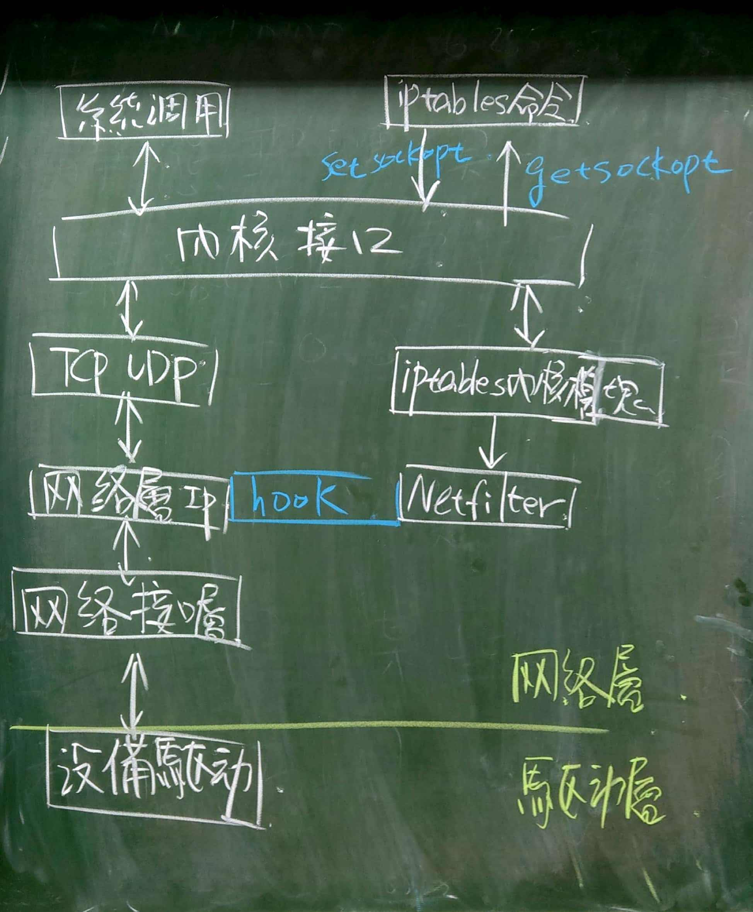
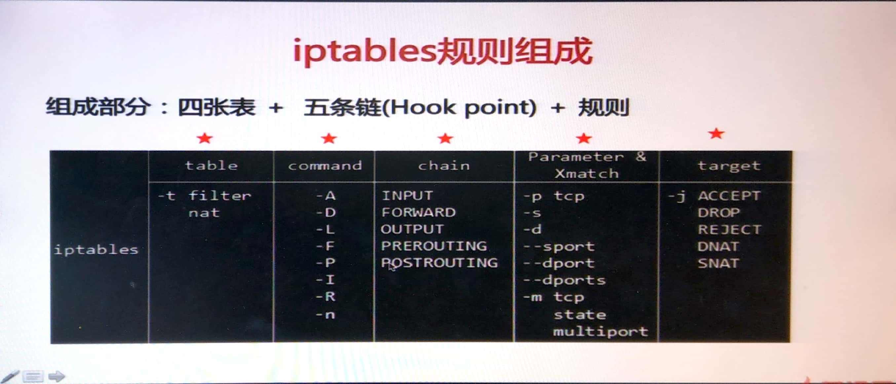
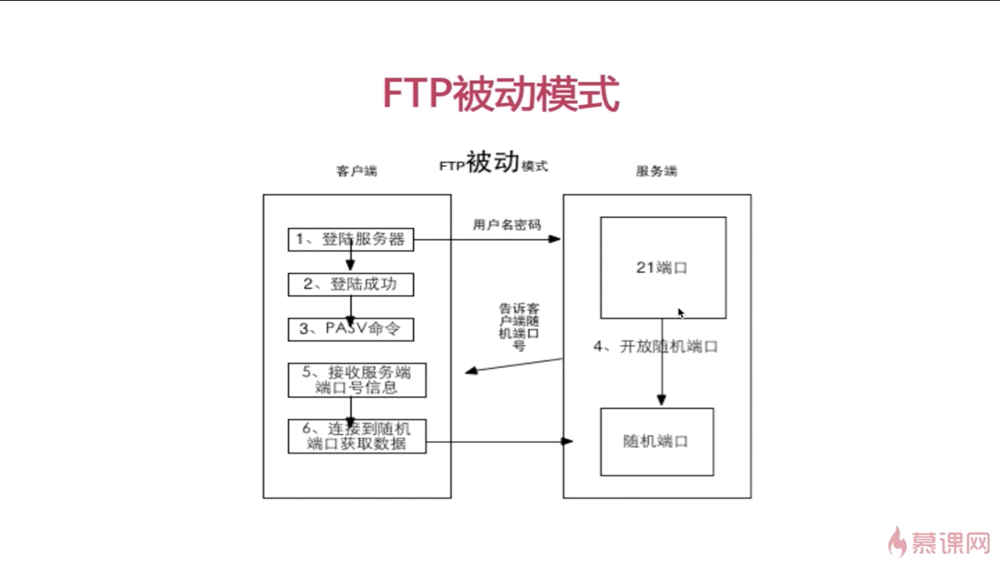
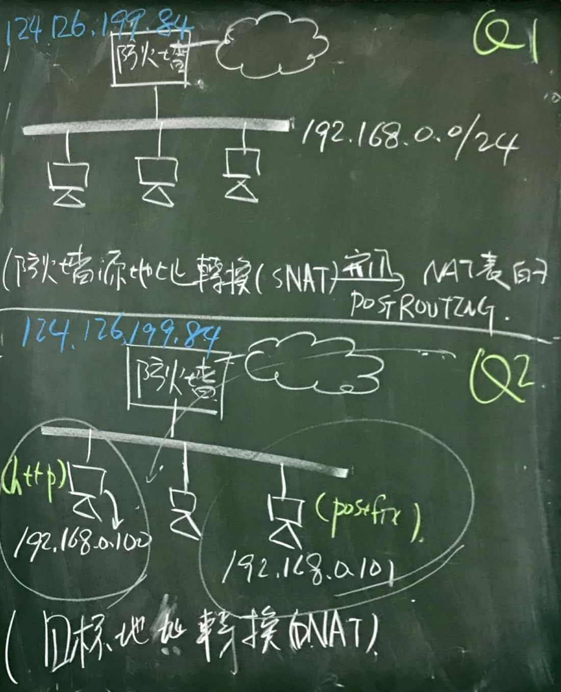

<h1><b>注意：此份文件仍在修訂中，若有錯誤請發 Issues，感謝！</h1></b>

# 目錄
- [目錄](#%E7%9B%AE%E9%8C%84)
- [雜記](#%E9%9B%9C%E8%A8%98)
- [iptables](#iptables)
	- [環境配置](#%E7%92%B0%E5%A2%83%E9%85%8D%E7%BD%AE)
	- [常用指令](#%E5%B8%B8%E7%94%A8%E6%8C%87%E4%BB%A4)
	- [Netfilter 與 iptables](#netfilter-%E8%88%87-iptables)
	- [iptables 規則組成](#iptables-%E8%A6%8F%E5%89%87%E7%B5%84%E6%88%90)
		- [A. 四張表(Table)](#a-%E5%9B%9B%E5%BC%B5%E8%A1%A8table)
		- [B. 命令(Command)](#b-%E5%91%BD%E4%BB%A4command)
		- [C. 五條鏈(Chain)](#c-%E4%BA%94%E6%A2%9D%E9%8F%88chain)
		- [D. 參數(Parameter)](#d-%E5%8F%83%E6%95%B8parameter)
		- [E. 目標(Target)](#e-%E7%9B%AE%E6%A8%99target)
			- [訪問控制](#%E8%A8%AA%E5%95%8F%E6%8E%A7%E5%88%B6)
			- [封包改寫](#%E5%B0%81%E5%8C%85%E6%94%B9%E5%AF%AB)
			- [訊息記錄](#%E8%A8%8A%E6%81%AF%E8%A8%98%E9%8C%84)
	- [作業A：場景一](#%E4%BD%9C%E6%A5%ADa%E5%A0%B4%E6%99%AF%E4%B8%80)
	- [場景一存在的問題](#%E5%A0%B4%E6%99%AF%E4%B8%80%E5%AD%98%E5%9C%A8%E7%9A%84%E5%95%8F%E9%A1%8C)
	- [複習網路 IP（Class A, B, C）](#%E8%A4%87%E7%BF%92%E7%B6%B2%E8%B7%AF-ipclass-a-b-c)
	- [iptables 配置二](#iptables-%E9%85%8D%E7%BD%AE%E4%BA%8C)
		- [FTP 主動模式 vs. 被動模式](#ftp-%E4%B8%BB%E5%8B%95%E6%A8%A1%E5%BC%8F-vs-%E8%A2%AB%E5%8B%95%E6%A8%A1%E5%BC%8F)
			- [FTP 主動模式](#ftp-%E4%B8%BB%E5%8B%95%E6%A8%A1%E5%BC%8F)
			- [FTP 被動模式](#ftp-%E8%A2%AB%E5%8B%95%E6%A8%A1%E5%BC%8F)
	- [作業B](#%E4%BD%9C%E6%A5%ADb)
		- [參考解答](#%E5%8F%83%E8%80%83%E8%A7%A3%E7%AD%94)
- [參考資料](#%E5%8F%83%E8%80%83%E8%B3%87%E6%96%99)

---

# 雜記
* W14 調課到 6/5(三) 18:30 ~ 21:30
* 期末報告延到第 18 週
* 會先播 iptables 的 MOOC，第三節課再分組進行實作任務

---

* 現在上網不一定要用 80 port，因此沒辦法僅針對 Port 號封鎖。因此需透過深度封包檢測(Deep Packet Inspection, DPI)，將同一份資訊傳到 DPI 去做檢測，若是 http 封包則讓 Switch 做封鎖
* `iptables -I INPUT -p tcp --dport 22 -j ACCEPT`：之所以要開啟 22 port(SSH)，是因為在企業的環境中，須透過 SSH 來連線到主機中，因此需要針對每位操作者做設定
* SecureCRT 中有 `cz`, `rz` 指令能直接上傳、下載檔案

---

* TODO : 背 TCP/UDP 通訊協定的 Port
* TODO : 學習 `nmap`
* TODO : 回家後要把 imooc 上的課程看完

# iptables
> 參考課程：[用iptables搭建一套強大的安全防護盾-慕課網](https://www.imooc.com/learn/389)
* 定義：應用層防火牆工具
* 目標人群：網管、安全人員
* 用途
  * 搭建防火牆規則
  * 進行防守與攻擊
  * 進行封包轉發
* 需透過超級使用者的權限才能使用，但建議使用一般使用者搭配 `sudo` 指令

## 環境配置
* IP1(client): 10.10.163.232
* IP2(server): 10.10.163.233

## 常用指令
* iptalbes
  * `iptables -v`：查看 iptables 版本
  * `iptables -L`：列出所有規則
  * `w`：能查看 Apache 的負載
* 會透過 ab 指令來測試
  * 在 IP1 輸入 `ab -n 10000000 -c 40 http://10.10.163.233/test.txt` （類似於 curl？）
  * 在 IP2 輸入 `iptables -I INPUT -p tcp --dport 80 -s 10.10.163.232 -m connlimit --connlimit -aboe 10 -j DROP` 
    * 針對 `10.10.163.232` 進行封鎖

## Netfilter 與 iptables


* 什麼是 Netfilter？
  * Linux 核心層內部的封包處理模組
  * 換言之，iptables 所做的操作都需要用到 Netfilter 模組
  * 由下到上分成驅動、內核與用戶層
* Hook point：封包在 Netfilter 中的掛載點（有 PRE_ROUTING, INPUT, OUTPUT, FORWARD, POST_ROUTING）

## iptables 規則組成
> `iptables` + [Table](#a-%E5%9B%9B%E5%BC%B5%E8%A1%A8table) + [Command](#b-%E5%91%BD%E4%BB%A4command) + [Chain](#c-%E4%BA%94%E6%A2%9D%E9%8F%88chain) + [Parameter](#d-%E5%8F%83%E6%95%B8parameter) + [Target](#e-%E7%9B%AE%E6%A8%99target)




### A. 四張表(Table)
> * 若無特別指定，預設採用 filter table
> * 優先順序：raw -> mangle -> nat -> filter
> * mangle 與 raw 表較不常用
1. **filter**：一般的過濾功能（訪問控制、規則匹配）
2. **raw**：地址轉發、端口映射
3. mangle（破壞者）：修改封包，改變標頭內容（TTL, TOS, MARK 等）
4. raw：因為優先級最高，能在 kernel 尚未檢查封包狀態前進行操作，進而提升效能

### B. 命令(Command)
> * `-I`:Insert, `-A`:Append
> * **注意規則順序**：因為規則由上到下匹配，因此若透過 `-A` Drop 到底部。當上方有 Accept 規則時，此封包仍可通過（=不被 Drop）
> 
* `-A`, `--append`：附加在最下方
* `-D`, `--delete`
* `-I`, `--insert`：插入在最上方
* `-F`, `--flush`：沖洗(清空)規則
* `-L`, `--list`：列出所有規則
* `-R`, `--replace`
* `-Z`, `--zero`：清空數據表訊息
* `-P`, `--policy`：設置鏈默認規則

### C. 五條鏈(Chain)
1. INPUT
2. FORWARD
3. OUTPUT
4. PREROUTING
5. POSTROUTING

### D. 參數(Parameter)
> 前面若加上 `!` 代表相反，如 `! -p`
* `-p`, `--protocol`：如 `-p tcp`
* `-s`, `--source`
* `-d`, `--destination`
* `-i`, `--in-interface`（設備名字）：如 `-i lo`
* `--sport`：Source port
* `--dport`：Destination port，如 `--dport 22`
* `--src-range`
* `--dst-range`
* `--limit`
* `--mac-source`
* `--state`
* `--string`

### E. 目標(Target)
* 分成訪問控制、封包改寫與訊息記錄
* `-j`, `--jump`
#### 訪問控制
> 註：DROP ≠ REJECT，DROP 是接收後丟棄；REJECT 是不接收
1. ACCEPT
2. DROP
3. REJECT

#### 封包改寫
1. SNAT（針對來源）
2. DNAT（針對目標）

#### 訊息記錄
1. LOG

## 作業A：場景一
> 需設置兩台虛擬機，一台 Client，一台 Server

1. 對所有的地址開放本機的 TCP（80, 22, 10~21）端口的訪問
    > 註：`--dport 10:21` 代表 10~21 port
```
iptables -I INPUT -p tcp --dport 80 -j ACCEPT
iptables -I INPUT -p tcp --dport 22 -j ACCEPT
iptables -I INPUT -p tcp --dport 10:21 -j ACCEPT
```

2. 允許對所有的地址開放本機的基於 ICMP 協議的訪問
```
iptables -I INPUT -p icmp -j ACCEPT
```

3. 其他未被允許的端口則禁止訪問
```
iptables -A INPUT -j REJECT
```

## 場景一存在的問題
1. 本機無法訪問本機
  * 解決方法：`iptables -I INPUT -i lo -j ACCEPT`
2. 本機無法訪問其他主機
  * 解決方法：`iptables -i INPUT -m state --state ESTABLISHED,RELATED -j ACCEPT`

## 複習網路 IP（Class A, B, C）
> 要對 IP 的數字有點敏感度
* class A (1.0.0.0 ~ 126.255.255.255)
* class B (128.0.0.0 ~ 191.255.255.255)
* class C (192.0.0.0 ~ 255.255.255.255)

## iptables 配置二
* FTP 連接預設為被動模式
* vsftpd 服務支援主動模式須設置：
```
port_enable=yes
connect_from_port_20=yes
```
* iptables 需要開啟 port 21 的訪問權限
```
iptables -I INPUT -p tcp --dport 21 -j ACCEPT
iptables -I INPUT -p tcp --dport 22 -j ACCEPT
iptables -I INPUT -p icmp -j ACCEPT
iptables -I INPUT -m state --state ESTABLISHED,RELATED -j ACCEPT
iptables -A INPUT -j REJECT
```

### FTP 主動模式 vs. 被動模式
> 參考：[FTP協定](http://irw.ncut.edu.tw/peterju/course/network/971/doc/homework/07/ftp.html#6) -> FTP 主動與被動模式差異
#### FTP 主動模式


#### FTP 被動模式


* 差異
  * 主動模式的 Client 隨機使用大於 1023 的埠
  * 主動模式需開啟資訊通訊埠（Port 20）
  * 除非兩台機器直接連接，否則一般不建議主動模式連接

## 作業B


### 參考解答
1. `iptables -t nat -I POSTROUTING -s 192.168.0.0/24 -j SNAT --to-source 124.126.199.82`
2. 

# 參考資料
1. [用iptables搭建一套強大的安全防護盾-慕課網](https://www.imooc.com/learn/389)
2. [An In-Depth Guide to iptables, the Linux Firewall - Boolean World](https://www.booleanworld.com/depth-guide-iptables-linux-firewall/)
3. [iptables(8) - Linux man page](https://linux.die.net/man/8/iptables)
4. [鳥哥的 Linux 私房菜 -- Linux 防火牆與 NAT 伺服器](http://linux.vbird.org/linux_server/0250simple_firewall.php#netfilter)
5. [FTP協定](http://irw.ncut.edu.tw/peterju/course/network/971/doc/homework/07/ftp.html#6) -> FTP 主動與被動模式差異
6. [iptables命令、規則、參數詳解 - zclzhao - 博客園](https://www.cnblogs.com/zclzhao/p/5081590.html)
7. [linux107b/Week 15.md at master · ChiaYuSu/linux107b](https://github.com/ChiaYuSu/linux107b/blob/master/Week%2015.md)