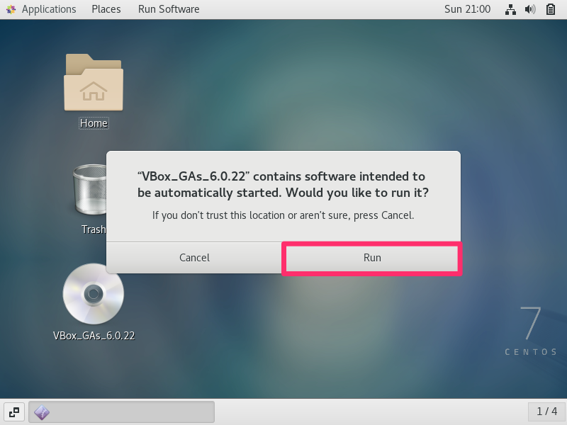
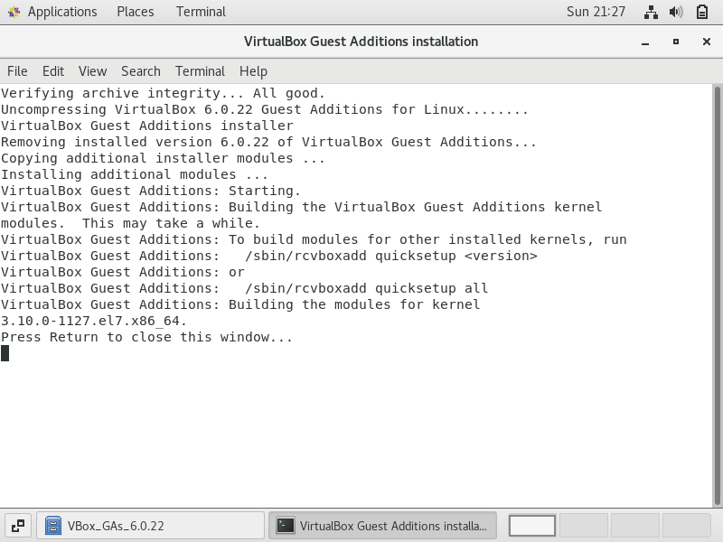
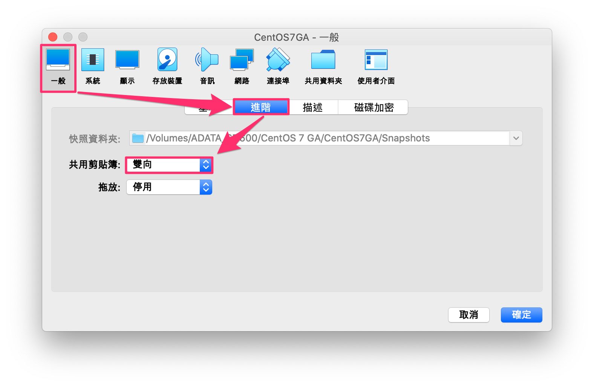

# W2 20180918

- [W2 20180918](#w2-20180918)
	- [雜記](#雜記)
	- [C11 好用的指令工具](#c11-好用的指令工具)
		- [目錄空間使用量－du](#目錄空間使用量du)
		- [通常會佔據大量空間的資料夾](#通常會佔據大量空間的資料夾)
	- [習題](#習題)
	- [CLI 快捷鍵](#cli-快捷鍵)
	- [debug](#debug)
		- [問題：user is not in the sudoers file](#問題user-is-not-in-the-sudoers-file)
	- [安裝 VirtualBox Guest Addition on CentOS 7](#安裝-virtualbox-guest-addition-on-centos-7)
		- [操作步驟](#操作步驟)

## 雜記

- 老師建議學習 Windows Server、PowerShell
- Windows 中有一個功能稱作活動目錄（Active Directory）
  - Windows 裡有網域、工作群組的功能
    - 工作群組適合小型的企業，因為它並沒有階層的概念
    - 在同一個網域內，使用同一組帳號密碼，都可以登入進去
    - 網域實際上是由活動目錄（Active Directory）所管理
  - 因此老師建議可以自己安裝 Windows Server 來玩看看，然後搭配書籍或 MOOC
- 如果要學習 Windows Server，建議在虛擬機中搭建 Windows 7, 8, 10, Server，並組成同一個網域

## C11 好用的指令工具

### 目錄空間使用量－du

- 需注意權限的問題，如果要查看 root 資料夾的空間使用量，需使用 sudo 取得權限
- `du --max-depth=1 /` 等同於 `du -d 1 /`（注意 `-d` 與 1 中間並非等號，而是空白）

### 通常會佔據大量空間的資料夾

- `/var` : 系統的可變動檔，通常佔用最多的空間
    - sudo du -s /var
    - email, www, ftp server 通常在這
- `/etc` : 系統設定(如密碼、ssh)、網路相關(port)設定
    - sudo du -s /etc
- `/lib` : 第三方程式所佔用的空間
    - sudo du -s /lib

## 習題

1. 如果 `/tmp` 資料夾容量超過指定大小，發送信件通知

	```shell
	# MARK: 過濾出 /tmp 資料夾的空間使用率數值，並將結果賦予給 a 變數
	df -h # 列出目前掛載的磁碟分割區資訊
	df -h | grep /tmp # 篩選 /tmp 資料夾
	df -h | grep /tmp | awk '{print $5}' # 只印出使用率(第五個參數)，在此會印出 1%
	df -h | grep /tmp | awk '{print $5}' | tr "%" " " # 只想保留數字，因此將 % 以空白取代
	df -h | grep /tmp | awk '{print $5}' | tr -d "%" # 補充：上面這行也可改用此寫法，將 % 刪除
	a=`df -h | grep /tmp | awk '{print $5}' | tr "%" " "` # 將結果賦予給 a 變數，注意 a 與 = 間不能有空格

	# MARK: 寄信
	echo "disk space is not enough" > problem # 將信件內容重導至 problem 檔案
	cat problem # 查看 problem 檔案的內容
	if [ $a -gt 90 ]; then mail -s "disk problem" istar0me@gmail.com < problem; fi # 如果 a 變數的值大於 90，寄信到 istar0me、主旨為 disk problem、內文為 problem 檔案的內容

	# MARK: 測試
	dd if=/dev/zero of=/tmp/file100M bs=1M count=100 # 在 /tmp 建立一個名為 file100M 的檔案，大小為 1M - 100 = 100MB；注意 bs 要輸入 1M 而非 1m
	```

2. 將習題 1 寫入腳本檔案，並新增檔案測試

	```bash
	gedit check_tmp.sh # 透過 gedit 編輯器新增且編輯腳本檔
	```

- 在 `check_tmp.sh` 檔案中輸入以下內容：

	```shell
	#!/bin/bash

	while true
	do
	a=`df -h | grep /tmp | awk '{print $5}' | tr -d "%"`
	if [ $a -gt 90 ];then
		mail -s "disk problem" istar0me@gmail.com < problem;
		echo "mail sent"
	fi
	sleep 3
	done
	```

- 繼續回到終端機操作：

	```bash
	sudo chmod u+x ./check_tmp.sh # 修改權限，讓使用者能執行腳本檔

	sudo yum install httpd # 安裝 Apache 伺服器
	sudo systemctl start httpd # 啟動 Apache 伺服器
	sudo netstat -tunlp | grep httpd # 查看網路狀態，確認是否執行
	# 也可以開啟 127.0.0.1 確認是否執行中

	sudo ab -n 50000 -c 100 http://127.0.0.1 # 對 Web Server 做壓力測試
	# -n 50000 : 50000 requests(請求), -c 100 : 100 Concurrences(數量)
	```

3. 建立 Apache 伺服器進行壓力測試，當記憶體到達指定百分比，發送通知提醒工程師。

4. 將習題 2 的訊息轉寄到 LINE 或 WeChat

## CLI 快捷鍵

- 移至行起始處：Control + A
- 移至行結尾處：Control + E
- 清除至行起始處：Control + U
- 清除至行結尾處：Control + K
- 參考：[終端機鍵盤快速鍵 - Apple 支援](https://support.apple.com/zh-tw/guide/terminal/trmlshtcts/mac)

## debug

### 問題：user is not in the sudoers file

- 操作步驟：

	```
	user@localhost ~]$ sudo echo hi
	[sudo] password for user: 
	user is not in the sudoers file.  This incident will be reported.
	[user@localhost ~]$ su
	Password: 
	[root@localhost minidino]# ls -l /etc/sudoers
	-r--r-----. 1 root root 4000 Jan 15  2014 /etc/sudoers
	[root@localhost minidino]# chmod u+w /etc/sudoers
	[root@localhost minidino]# vi /etc/sudoers
	[root@localhost minidino]# chmod u-w /etc/sudoers
	[root@localhost minidino]# sudo echo hi
	hi
	```

- 參考：[[轉貼] xxx is not in the sudoers file解决方法 @ 經驗交流分享與備忘 :: 痞客邦 ::](http://uiop7890.pixnet.net/blog/post/29385923-%5B%E8%BD%89%E8%B2%BC%5D-xxx-is-not-in-the-sudoers-file%E8%A7%A3%E5%86%B3%E6%96%B9%E6%B3%95)

## 安裝 VirtualBox Guest Addition on CentOS 7

> 注意：操作前請先製作快照或備份

- 功能
  - 主機與客機共用剪貼簿，方便記錄筆記
  - 客機畫面隨視窗大小動態調整

- 為什麼一開始會安裝失敗？
  - 通常是 kernel 版本不匹配所致，因此以下教學著重在安裝對應的 kernel 版本

### 操作步驟

1. 查看系統的 kernel 版本

    ```sh
    uname -r # 3.10.0-1127.el7.x86_64
    ```

2. 查看目前已安裝的 kernel 版本。若有包含步驟一的版本，則可以直接跳到步驟四
   - kernel 版本須完全相同，因為筆者的版本（3.10.0-1127.**10.1**.el7.x86_64）並非完全相同，因此需操作步驟三

	```sh
	ls /usr/src/kernels/ # 3.10.0-1127.10.1.el7.x86_64
	```

3. 安裝與系統相對應版本的 kernel

	```sh
	sudo yum install -y "kernel-devel-uname-r == $(uname -r)"
	sudo yum install -y gcc perl kernel-headers kernel-devel
	```

4. 重開機後，插入 Guest Additions CD 映像

	

5. 執行剛剛的映像檔

	

6. 完成後應會見到此畫面

	

7. 若上一步驟沒出現 Error 或 Failed，重新開機即可

	```sh
	reboot
	```

8. 若要共用剪貼簿，在 VirtualBox 中設定即可，筆者在此設定為「雙向」共用剪貼簿

	

9. 完成 :D

- 參照
   - [How to install VirtualBox Guest Additions on CentOS 7 Linux - LinuxConfig.org](https://linuxconfig.org/how-to-install-virtualbox-guest-additions-on-centos-7-linux)
   - [How To Resolve VirtualBox Guest Additions: Kernel Headers Not Found For Target Kernel Error](https://www.dev2qa.com/how-to-resolve-virtualbox-guest-additions-kernel-headers-not-found-for-target-kernel-error/)