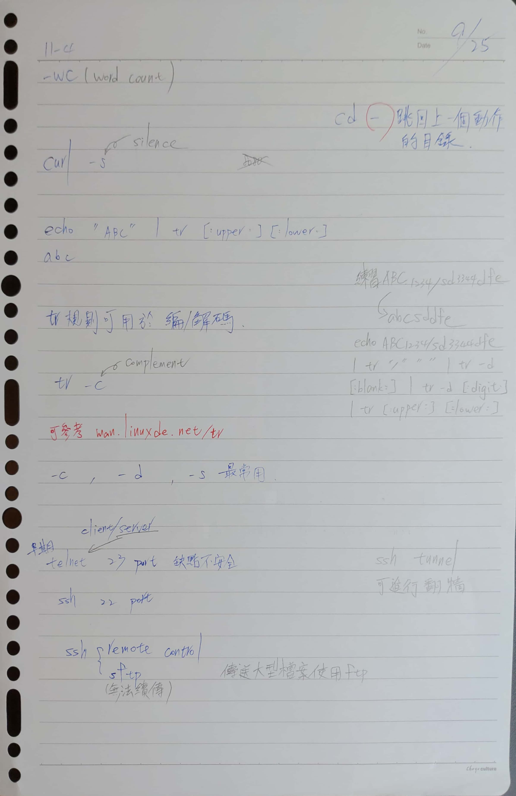
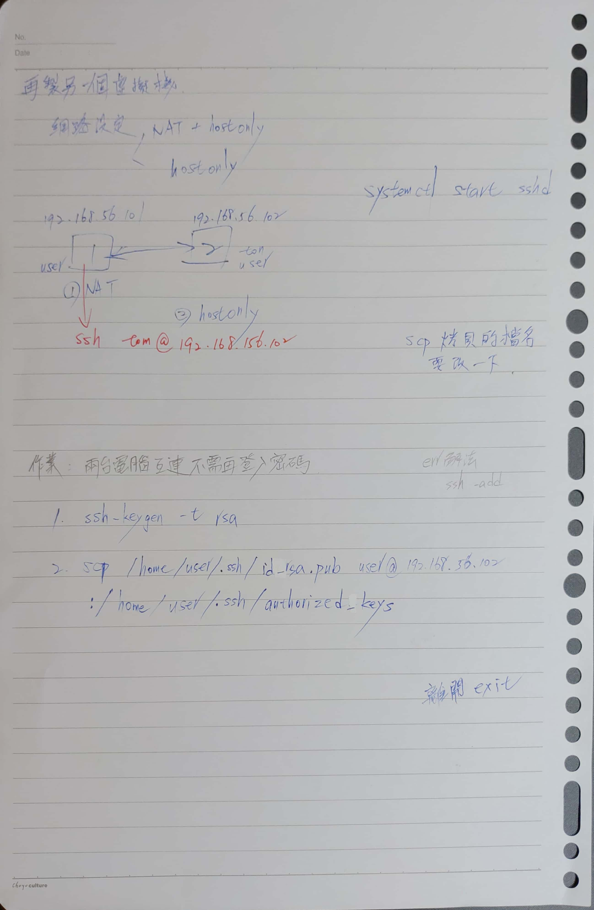

# C11-1 ~ C11-2 遠端控制
* 老師對不起，不小心睡過頭沒去上課 ><
* 步驟可參考 [How To Set Up SSH Keys on CentOS 7 | DigitalOcean](https://www.digitalocean.com/community/tutorials/how-to-set-up-ssh-keys-on-centos7)

# 謝昇遠提供的課程內容
```
你看照片能不能看得清楚
主要是從11-1-4開始
然後到11-2-2 跨主機複製檔案
因為要弄跨主機，所以要多再製一個虛擬機
原本的那台，網路設定，多勾一個介面卡2(host only)
多加的那台，勾一個host only就好
課堂上的練習主要是使用ssh登入另一台主機，試複製檔案之類的東西
一般的ssh在登入時會要求輸入帳密
多開的作業是透過使用 keygen 來生成金鑰(?) 然後複製回來，讓之後再ssh不用再重複輸入帳密
大概是這樣，不過我自己目前只有試到可以互相ssh，但是keygen後複製回來後還沒成功讓他不用再輸入帳密
```



# 遠端控制前準備動作
> 為方便說明，以下以 A 機稱呼原本的機器；B 機稱呼再製的機器

* 再製一台機器 B
* A 機網路再增加一個介面卡，設定為 Host only
* B 機將原本的介面卡設定為 Host only
* 備註
    * A 機仍能連上 Internet，但 B 機不行，可是兩台機器間能夠互連（能夠互相 Ping 到對方）
    * Host only 模式下 IP 皆為 192.168.56 開頭
    * 在筆者環境下，A 機 IP 為 192.168.56.101；B 機為 192.168.56.102（可透過 `ifconfig` 查詢）
    * 各種模式差異可參考上學期 `W2 20180305.md` 筆記內容

# ssh 遠端主機登入
> 在 ssh 中，被連接的機器稱為 Server，連接他人的機器為 client

> 兩台的使用者名稱皆為 minidino，因此目錄為 `/home/minidino`，並非是 `/home/user`

* 記得雙方都需要先開啟 ssh（注意需有 Root 權限）
```shell
[user@localhost ~]$ systemctl start sshd
Failed to issue method call: Access denied
[user@localhost ~]$ sudo systemctl start sshd
```

* 如果成功開啟，可以透過以下指令查詢：
```shell
[user@localhost ~]$ sudo netstat -anp | grep sshd
tcp        0      0 0.0.0.0:22              0.0.0.0:*               LISTEN      2804/sshd           
tcp6       0      0 :::22                   :::*                    LISTEN      2804/sshd           
unix  3      [ ]         STREAM     CONNECTED     24986    2804/sshd           
```

* 注意：如果有一方未開啟 ssh，可能會跳出以下錯誤訊息
```shell
[user@localhost ~]$ sudo ssh user@192.168.56.102
ssh: connect to host 192.168.56.102 port 22: Connection refused
```

* 如果見到以下訊息，代表正確連接
* 需要確認是否連接與詢問對方的密碼
```shell
[user@localhost ~]$ sudo ssh user@192.168.56.102
The authenticity of host '192.168.56.102 (192.168.56.102)' can't be established.
ECDSA key fingerprint is 6e:74:ef:33:9e:99:c2:61:b6:30:d1:27:c0:88:e9:30.
Are you sure you want to continue connecting (yes/no)? yes
Warning: Permanently added '192.168.56.102' (ECDSA) to the list of known hosts.
user@192.168.56.102's password: 
Last login: Tue Oct  2 03:12:26 2018
```

* 由於兩台主機的使用者名稱相同，因此可查看 `ifconfig` 中的 IP 來辨別（如以下 IP 為 B 機的 `192.168.56.102`）
```shell
[user@localhost ~]$ ifconfig
enp0s3: flags=4163<UP,BROADCAST,RUNNING,MULTICAST>  mtu 1500
        inet 192.168.56.102  netmask 255.255.255.0  broadcast 192.168.56.255
        inet6 fe80::a00:27ff:fef4:7f43  prefixlen 64  scopeid 0x20<link>
        ether 08:00:27:f4:7f:43  txqueuelen 1000  (Ethernet)
        RX packets 100  bytes 16725 (16.3 KiB)
        RX errors 0  dropped 0  overruns 0  frame 0
        TX packets 115  bytes 17115 (16.7 KiB)
        TX errors 0  dropped 0 overruns 0  carrier 0  collisions 0

lo: flags=73<UP,LOOPBACK,RUNNING>  mtu 65536
        inet 127.0.0.1  netmask 255.0.0.0
        inet6 ::1  prefixlen 128  scopeid 0x10<host>
        loop  txqueuelen 0  (Local Loopback)
        RX packets 12  bytes 820 (820.0 B)
        RX errors 0  dropped 0  overruns 0  frame 0
        TX packets 12  bytes 820 (820.0 B)
        TX errors 0  dropped 0 overruns 0  carrier 0  collisions 0
```

* 可透過 `exit` 指令登出遠端主機
```shell
[user@localhost ~]$ exit
logout
Connection to 192.168.56.102 closed.
```

* 此時 B 機也可連接上 A 機
```shell
[user@localhost Desktop]$ ssh user@192.168.56.101
The authenticity of host '192.168.56.101 (192.168.56.101)' can't be established.
ECDSA key fingerprint is 6e:74:ef:33:9e:99:c2:61:b6:30:d1:27:c0:88:e9:30.
Are you sure you want to continue connecting (yes/no)? yes
Warning: Permanently added '192.168.56.101' (ECDSA) to the list of known hosts.
user@192.168.56.101's password: 
Last login: Tue Oct  2 03:12:21 2018
[user@localhost ~]$ ifconfig
enp0s3: flags=4163<UP,BROADCAST,RUNNING,MULTICAST>  mtu 1500
        ether 08:00:27:9e:83:a1  txqueuelen 1000  (Ethernet)
        RX packets 256  bytes 18875 (18.4 KiB)
        RX errors 0  dropped 0  overruns 0  frame 0
        TX packets 0  bytes 0 (0.0 B)
        TX errors 0  dropped 0 overruns 0  carrier 0  collisions 0

enp0s8: flags=4163<UP,BROADCAST,RUNNING,MULTICAST>  mtu 1500
        inet 192.168.56.101  netmask 255.255.255.0  broadcast 192.168.56.255
        inet6 fe80::a00:27ff:fe65:10fa  prefixlen 64  scopeid 0x20<link>
        ether 08:00:27:65:10:fa  txqueuelen 1000  (Ethernet)
        RX packets 263  bytes 43395 (42.3 KiB)
        RX errors 0  dropped 0  overruns 0  frame 0
        TX packets 142  bytes 20318 (19.8 KiB)
        TX errors 0  dropped 0 overruns 0  carrier 0  collisions 0

lo: flags=73<UP,LOOPBACK,RUNNING>  mtu 65536
        inet 127.0.0.1  netmask 255.0.0.0
        inet6 ::1  prefixlen 128  scopeid 0x10<host>
        loop  txqueuelen 0  (Local Loopback)
        RX packets 8  bytes 480 (480.0 B)
        RX errors 0  dropped 0  overruns 0  frame 0
        TX packets 8  bytes 480 (480.0 B)
        TX errors 0  dropped 0 overruns 0  carrier 0  collisions 0
```

# scp 跨主機複製檔案
* 從 A 機的桌面傳送名為 `host` 的檔案給 B 機
```shell
[user@localhost Desktop]$ scp host user@192.168.56.102:/home/minidino/Desktop
The authenticity of host '192.168.56.102 (192.168.56.102)' can't be established.
ECDSA key fingerprint is 6e:74:ef:33:9e:99:c2:61:b6:30:d1:27:c0:88:e9:30.
Are you sure you want to continue connecting (yes/no)? yes
Warning: Permanently added '192.168.56.102' (ECDSA) to the list of known hosts.
user@192.168.56.102's password: 
host                                          100%    0     0.0KB/s   00:00
```

# 透過 keygen 來產生金鑰，以達成「記住密碼」效果
### 以下示範 server:B, client:A
* 在 A 機輸入 `ssh-keygen -t rsa`
    * `-t` : type
    * rsa 為非對稱式加密，會有一把公鑰與私鑰
    * 公鑰僅做加密用；私鑰僅做解密用
    * 若未指定路徑，金鑰預設儲存在 `/home/minidino/.ssh/id_rsa` 資料夾
```shell
[user@localhost Desktop]$ ssh-keygen -t rsa
Generating public/private rsa key pair.
Enter file in which to save the key (/home/minidino/.ssh/id_rsa): 
Enter passphrase (empty for no passphrase): 
Enter same passphrase again: 
Your identification has been saved in /home/minidino/.ssh/id_rsa.
Your public key has been saved in /home/minidino/.ssh/id_rsa.pub.
The key fingerprint is:
87:c4:91:2f:2f:c1:f9:d9:10:dd:de:06:54:ff:7b:19 user@localhost.localdomain
The key's randomart image is:
+--[ RSA 2048]----+
|        .. . o...|
|       .... . o .|
|       .oo . . o.|
|       .=.o   . +|
|        S=.+   E.|
|        ..+ .   +|
|         .     o.|
|                .|
|                 |
+-----------------+
```

* 產生密鑰後，查看他們的檔案
    * `id_rsa` 為私鑰；`id_rsa.pub`為公鑰
```shell
[user@localhost Desktop]$ cd /home/minidino/.ssh
[user@localhost .ssh]$ ls -l
total 12
-rw------- 1 user user 1675 Oct  2 04:03 id_rsa
-rw-r--r-- 1 user user  408 Oct  2 04:03 id_rsa.pub
-rw-r--r-- 1 user user  176 Oct  2 03:58 known_hosts
```

#### 將 A 機的公鑰 `id_rsa.pub` 內容插入(insert)到 B 機
* 有四種方法：
    1. `ssh-copy-id`（推薦）
    2. `SSH`
    3. manually（手動）
    4. `scp`（不建議，會覆蓋掉 B 機原本存放的金鑰）
    * 這邊為了測試採用 `scp` 方法，其他方法可參考 [How To Set Up SSH Keys on CentOS 7 | DigitalOcean](https://www.digitalocean.com/community/tutorials/how-to-set-up-ssh-keys-on-centos7#step-2-—-copy-the-public-key-to-centos-server)

* 先確認 A 機的金鑰是否有產生
```shell
[user@localhost .ssh]$ ls -l /home/minidino/.ssh
total 12
-rw------- 1 user user 1675 Oct  2 04:03 id_rsa
-rw-r--r-- 1 user user  408 Oct  2 04:03 id_rsa.pub
-rw-r--r-- 1 user user  176 Oct  2 03:58 known_hosts
```

* 將 A 機的公鑰（`id_rsa.pub`）複製到 B 機的 `/home/minidino/.ssh/authorized_keys` 檔案中
```shell
[user@localhost .ssh]$ scp /home/minidino/.ssh/id_rsa.pub user@192.168.56.102:/home/minidino/.ssh/authorized_keys
user@192.168.56.102's password: 
id_rsa.pub                                    100%  408     0.4KB/s   00:00
```

* 在 B 機中輸入以下指令，確認公鑰是否已傳送到 B 機
```shell
[user@localhost Desktop]$ ls -l /home/minidino/.ssh | grep authorized_keys
-rw-r--r-- 1 user user 408 Oct  2 04:34 authorized_keys
```

* 若 A 機公鑰已在 B 機（加密用），A 機再次遠端登入 B 機不會再出現輸入密碼提示，如下所示：
```shell
[user@localhost .ssh]$ ssh user@192.168.56.102
Last login: Tue Oct  2 03:53:25 2018 from 192.168.56.101
[user@localhost ~]$ ifconfig
enp0s3: flags=4163<UP,BROADCAST,RUNNING,MULTICAST>  mtu 1500
        inet 192.168.56.102  netmask 255.255.255.0  broadcast 192.168.56.255
        inet6 fe80::a00:27ff:fef4:7f43  prefixlen 64  scopeid 0x20<link>
        ether 08:00:27:f4:7f:43  txqueuelen 1000  (Ethernet)
        RX packets 643  bytes 96045 (93.7 KiB)
        RX errors 0  dropped 0  overruns 0  frame 0
        TX packets 565  bytes 69650 (68.0 KiB)
        TX errors 0  dropped 0 overruns 0  carrier 0  collisions 0

lo: flags=73<UP,LOOPBACK,RUNNING>  mtu 65536
        inet 127.0.0.1  netmask 255.0.0.0
        inet6 ::1  prefixlen 128  scopeid 0x10<host>
        loop  txqueuelen 0  (Local Loopback)
        RX packets 16  bytes 1060 (1.0 KiB)
        RX errors 0  dropped 0  overruns 0  frame 0
        TX packets 16  bytes 1060 (1.0 KiB)
        TX errors 0  dropped 0 overruns 0  carrier 0  collisions 0
```

### 反之亦然：server:A, client:B
* 產生金鑰前，先查看 `/home/minidino/.ssh` 資料夾中有什麼檔案
* 可以看到有 `authorized_hosts` 檔案，裡面儲存著 A 的公鑰（註：此檔案可以儲存多筆公鑰，但透過 `scp` 方式會覆寫其內容，因此只有一組公鑰）
```shell
[user@localhost Desktop]$ ls -l /home/minidino/.ssh
total 8
-rw-r--r-- 1 user user 408 Oct  2 04:34 authorized_keys
-rw-r--r-- 1 user user 176 Oct  2 03:49 known_hosts

[user@localhost Desktop]$ cat /home/minidino/.ssh/authorized_keys
ssh-rsa AAAAB3NzaC1yc2EAAAADAQABAAABAQCjfwsAwCSoMJpSEihnu3X9xVj/wP/LjnIJndxbmHF4WwILGIfX0GI612mns4FXC5WH4sRtf7YSMqdkdQh/95TFt8el5pfwIpGB4XIOJ91TcxhW4SnJP+ZkONpYQaQrs29XSeJJhz0HWRo29FljAO4730eJx/xBMCCd6Yn3PKaRehdMvj3F34mgOXp3XltsjJo4wGjMA7UbzI4oKj0k/Q8oyrdrhjElYzFVTAbIKcMGugP+o+gAJL++SFPrR0fZlSXth42vXRkaVsTRCmhK8EH87Eu7RpA4z3D8JjpJuCKC1EpGNDyHr6qPeC2rYI3xY0R43KaovpD0oz/AqwUTXDgD user@localhost.localdomain
```

* 接著產生 B 機的金鑰
```shell
[user@localhost Desktop]$ ls -l /home/minidino/.ssh | grep authorized_keys
-rw-r--r-- 1 user user 408 Oct  2 04:34 authorized_keys
[user@localhost Desktop]$ ssh-keygen -t rsa
Generating public/private rsa key pair.
Enter file in which to save the key (/home/minidino/.ssh/id_rsa): 
Enter passphrase (empty for no passphrase): 
Enter same passphrase again: 
Your identification has been saved in /home/minidino/.ssh/id_rsa.
Your public key has been saved in /home/minidino/.ssh/id_rsa.pub.
The key fingerprint is:
c8:d8:ef:79:5d:19:1c:62:58:1c:8f:17:36:c2:67:df user@localhost.localdomain
The key's randomart image is:
+--[ RSA 2048]----+
|           =+.+  |
|          . ==+o |
|           ..=oo.|
|     + .     .o E|
|    . + S      o |
|       .      o  |
|        .  . .   |
|       . .. .    |
|        o.       |
+-----------------+
```

* 先確認公鑰是否產生，再透過 `scp` 工具傳送 B 機的公鑰至 A 機
```shell
[user@localhost Desktop]$ ls -l /home/minidino/.ssh
total 16
-rw-r--r-- 1 user user  408 Oct  2 04:34 authorized_keys
-rw------- 1 user user 1675 Oct  2 04:47 id_rsa
-rw-r--r-- 1 user user  408 Oct  2 04:47 id_rsa.pub
-rw-r--r-- 1 user user  176 Oct  2 03:49 known_hosts
[user@localhost Desktop]$ scp /home/minidino/.ssh/id_rsa.pub user@192.168.56.101:/home/minidino/.ssh/authorized_keys
user@192.168.56.101's password: 
id_rsa.pub                                    100%  408     0.4KB/s   00:00
```

* 在 A 機上確認 B 機的公鑰是否存在
```shell
[user@localhost .ssh]$ ls -l /home/minidino/.ssh | grep authorized_keys
-rw-r--r-- 1 user user  408 Oct  2 04:56 authorized_keys
```

* 若 B 機公鑰已在 A 機（加密用），B 機再次遠端登入 A 機不會再出現輸入密碼提示，如下所示：
```shell
[user@localhost Desktop]$ ssh user@192.168.56.101
Last login: Tue Oct  2 03:49:57 2018 from 192.168.56.102
[user@localhost ~]$ ifconfig
enp0s3: flags=4163<UP,BROADCAST,RUNNING,MULTICAST>  mtu 1500
        ether 08:00:27:9e:83:a1  txqueuelen 1000  (Ethernet)
        RX packets 595  bytes 47233 (46.1 KiB)
        RX errors 0  dropped 0  overruns 0  frame 0
        TX packets 0  bytes 0 (0.0 B)
        TX errors 0  dropped 0 overruns 0  carrier 0  collisions 0

enp0s8: flags=4163<UP,BROADCAST,RUNNING,MULTICAST>  mtu 1500
        inet 192.168.56.101  netmask 255.255.255.0  broadcast 192.168.56.255
        inet6 fe80::a00:27ff:fe65:10fa  prefixlen 64  scopeid 0x20<link>
        ether 08:00:27:65:10:fa  txqueuelen 1000  (Ethernet)
        RX packets 910  bytes 126449 (123.4 KiB)
        RX errors 0  dropped 0  overruns 0  frame 0
        TX packets 496  bytes 74504 (72.7 KiB)
        TX errors 0  dropped 0 overruns 0  carrier 0  collisions 0

lo: flags=73<UP,LOOPBACK,RUNNING>  mtu 65536
        inet 127.0.0.1  netmask 255.0.0.0
        inet6 ::1  prefixlen 128  scopeid 0x10<host>
        loop  txqueuelen 0  (Local Loopback)
        RX packets 12  bytes 720 (720.0 B)
        RX errors 0  dropped 0  overruns 0  frame 0
        TX packets 12  bytes 720 (720.0 B)
        TX errors 0  dropped 0 overruns 0  carrier 0  collisions 0
```
