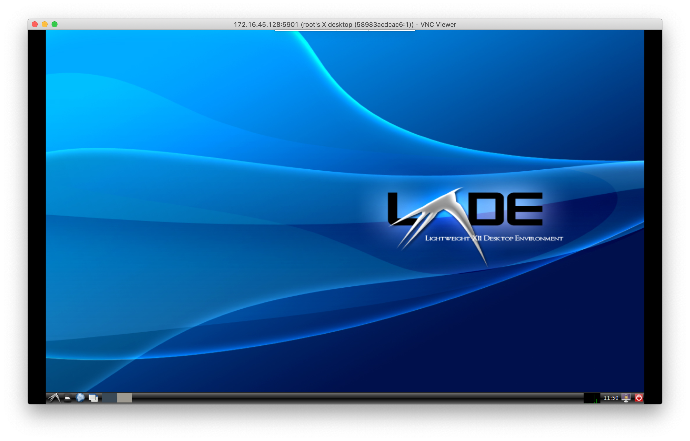
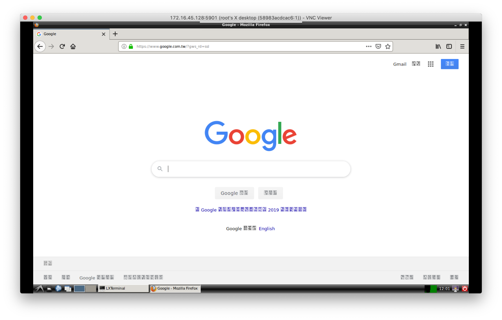
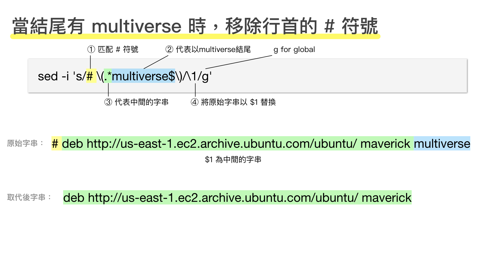

# W8

- [W8](#w8)
  - [Prerequisite](#prerequisite)
  - [Docker swarm](#docker-swarm)
    - [補充: sed (stream editor)](#%e8%a3%9c%e5%85%85-sed-stream-editor)
      - [範例: 移除行首的 # 符號](#%e7%af%84%e4%be%8b-%e7%a7%bb%e9%99%a4%e8%a1%8c%e9%a6%96%e7%9a%84--%e7%ac%a6%e8%99%9f)
  - [Other](#other)

## Prerequisite

- VNC Viewer
- Docker swarm
  - 2 CentOS VMs
- Kubernetes
  - 3 Ubuntu VMs (recommended version: 16.04)
    - master: 2 cores, 2GB RAM
    - slave1, slave2: not mentioned

## Docker swarm

```sh
git clone https://github.com/ayubiz/learn_docker_by_examples
cd ch13

# Build
docker build -t <dockerHubId>/ch13_remoteubuntu .

# Setup VNC server
docker run -it --rm -p 5901:5901 -e USER=root <dockerHubId>/ch13_remoteubuntu bash -c "vncserver :1 -geometry 1280x800 -depth 24 && tail -F /root/.vnc/*.log"
# Docker Container 若沒有程序持續執行，會自行關閉。因此在此透過 tail -F 來檢視 vnc 的 log 檔，避免關閉
# 會要求設置密碼，在此設定為 123456

# 為了避免 VNC 被阻擋，在此關閉防火牆與 SELinux
systemctl stop firewalld
systemctl disable firewalld
vim /etc/selinux/config # 將 SELinux 修改為 disable
```

- 接著開啟 VNC Viewer，連接到 `<IP>:5901`，應可見到下圖畫面：


- 雖然擁有圖形化介面，但還沒有相關的應用，在此下載 Firefox 示範

```
apt-get update
apt-get install -y firefox
```

- 執行 Firefox 的畫面



- 安裝完成後，可將此 container 上傳至 docker hub 中

- 接著再修改 Dockerfile 檔案，完成自動化

```Dockerfile
FROM ubuntu:14.04
MAINTAINER ayubowContainer <bowwowxx@gmail.com>

# set ubuntu to noninteractive
ENV DEBIAN_FRONTEND noninteractive
ENV HOME /root
ENV VNCPASS password # newline

ADD root/.bashrc /root/.bashrc
ADD root/.gitconfig /root/.gitconfig
ADD root/.scripts /root/.scripts

RUN sed -i 's/# \(.*multiverse$\)/\1/g' /etc/apt/sources.list

RUN \
  apt-get update && \
  apt-get -y upgrade && \
  apt-get install -y build-essential && \
  apt-get install -y software-properties-common && \
  apt-get install -y byobu curl git htop man unzip vim wget firefox && \  # changed: add firefox
  apt-get install -y xorg lxde-core lxterminal tightvncserver && \
  rm -rf /var/lib/apt/lists/*

RUN mkdir -p /root/.vnc # newline
RUN echo ${VNCPASS} | vncpasswd -f > /root/.vnc/ # newlinepasswd
RUN chmod 600 /root/.vnc/passwd # newline

EXPOSE 5901
WORKDIR /root

CMD vncserver :1 -name vnc -geometry 1280x800 && tail -f /root/.vnc/*:1.log # newline
```

- 再重新 build 一遍

```
docker build -t <dockerHubId>/ch13_remoteubuntu:v0.1 .
```

- 接著執行它

```
docker run -itd -p 5901:5901 --name desktop -e USER=root istar0me/ch13_remoteubuntu:v0.1
```

- 加分題1：移除 Firefox 的方塊字（字型不支援中文）

```sh
# download chinese font
unzip <fontZipFile>
apt-get install -y font-manager

font-manager # open font-manager
# install the downloaded font, then it will work like a charm
```

- 加分題2：安裝中文輸入法

// TODO: 補上截圖

### 補充: sed (stream editor)

> ref: [鳥哥的 Linux 私房菜 -- 第十一章、正規表示法與文件格式化處理](http://linux.vbird.org/linux_basic/0330regularex.php#sed)

#### 範例: 移除行首的 `#` 符號



```
sed -i 's/# \(.*multiverse$\)/\1/g' /etc/apt/sources.list
```

- `/etc/apt/sources.list`: apt 來源庫的網址
  - 若在行首有`#`，代表此行註解不執行
  - 雖然可以手動移除註解，但對於 Dockerfile 等自動化程序，需要透過 `sed` 等工具來移除
- `-i`, `--in-place`: edit files in place
- `sed 's/要被取代的字串/新的字串/g'`
  - `s` for substitute
  - `g` for global

## Other

- 下週（第九週）繼續上課
- 第十週（期中考週, 10/12）不上課
