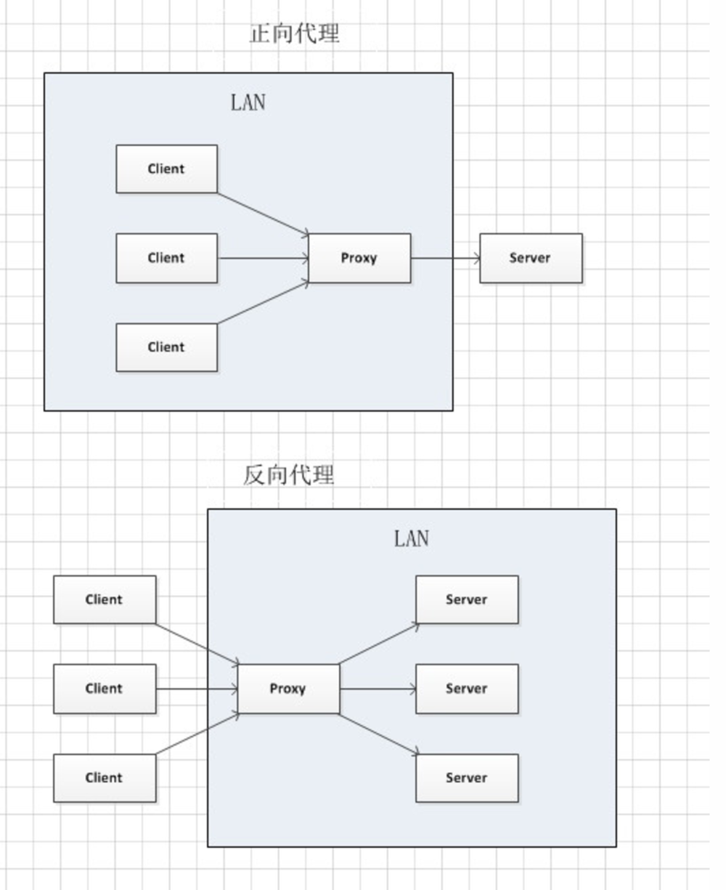

# systemd 線上課程
* [介绍systemd功能-51CTO学院](http://edu.51cto.com/center/course/lesson/index?id=132551)
* rpm：軟體管理的工具
* `rpm -ql systemd`：查詢套件所安裝的檔案清單
    * q：query
    * l：list
* `systemctl`等同於`systemctl list-units`
* `systemctl --state=all`：列出所有啟動的狀態
    * `systemctl --state=active`：列出所有啟動成功的服務
    * `systemctl --state=inactive`：列出所有未啟動的服務
    * `systemctl --state=failed`：列出所有啟動失敗的服務
* `systemctl list-unit-files`：
* `-` vs. `--`
    * `-`：指令的參數
    * `--`：參數的參數（還有其它的意思）
* kill 只能一次殺掉一個 process，但是如果一次要刪掉大量的 process（如 apache 伺服器的 httpd 服務一次會開啟多個 procees），可輸入 `pkill httpd` 來一次殺掉大量 process
---
* `systemctl enable httpd`：開機時自動啟動 httpd 服務
    * 這個指令會建立一個符號連結(symlink)
    * 可透過 `systemctl status httpd` 或 `systemctl is-enabled httpd` 確認開機是否自啟
* `systemctl is-active httpd` 能查看服務是否啟動中
    * `systemctl start httpd`
    * `systemctl stop httpd`
    * `systemctl restart httpd`
---
## 開、關與重開機
* `systemctl reboot`
* `systemctl poweroff`
* `systemctl shutdown`
* `systemctl start`

## 查看服務檔案
* `systemctl cat sshd.service`：查看指定服務檔案的內容
    * 或是輸入完整路徑，如 `cat /usr/lib/systemd/system/sshd.service`
    * `.service` 能省略，因此能寫成 `systemctl cat sshd`
### 檔案中有 [Unit], [Service], [Install] 三個區塊
* [Unit]
    * EnvironmentFile：設定檔案位置
    * Wants：所需要的服務
* [Service]
    * ExecReload：如果有這個選項，代表能輸入 `systemctl reload crond` 來重新啟動
        * 如果能用 reload 先用它，不行再用 restart
* [Install]
    * WantedBy：創建符號連結的位置
    * 如 WantedBy 為 `multi-user.target` 會創建符號連結到 `/etc/systemd/system/multi-user.target.wants`

## 分析 Unit 依賴關係
* [Unit] 中有 `After` 與 `Wants`
    * Wants：弱依賴
    * Requires：強依賴，所依賴的服務**必須**執行中
    * Before
    * After
* TODO：如何在 man 中搜尋？
* `systemctl list-dependencies sshd`：列出所依賴的服務

## 整體替換 service 文件
* `/etc/systemd/system/` 權重較 `/usr/lib/systemd/system/` 目錄高，因此如果兩個資料夾有同名稱的檔案，會先執行前者目錄內的檔案
* `systemctl edit --full sshd`：編輯 sshd 服務的檔案
    * `--full`：TODO：代表的意思？

## 局部替換 service 文件
* `systemctl edit sshd`
    * 不加 `--full` 參數
    * 使用此指令不需要重啟服務
    * 如果是使用 vim 等外部編輯器，需輸入 `systemctl daemon-reload` 重新載入
* 如果要更改 ExecStart 等重複屬性，須先設定空白值，再設定想要的值
```
[service]
ExecStart=
ExecStart=要設定的值
```

# C15 網頁伺服器架設
* 目前市佔前三名的伺服器：
    * Apache
        * 缺點：當客戶變多時，效能會變差
    * Nginx
        * 優點：效能非常好、除了能當伺服器外，也能當作*反向代理伺服器*
    * Microsoft-IIS

## 補充：Proxy 代理伺服器
* Proxy（正向代理伺服器）：Linux 中的 `squid` 指令
    * Proxy 也可以當作防火牆，但是僅限在應用層
* Reverse Proxy（反向代理伺服器）：能用來負載平衡，讓使用者連線到不同的 Server
* 

## 架設網頁伺服器步驟
* 為期末考的題目，佔比 10 分
```bash
rpm -qa | grep httpd # 列出目前安裝的清單，確認 httpd 是否有安裝過
yum install -y httpd # 如果未安裝過，此命令可以安裝
kill -9 指定pid # 如果被 yum 更新卡死，可以先強制關閉它

systemctl start httpd # 啟動 httpd 服務
systemctl status httpd # 確認 httpd 是否開啟方法 1
lsof -i:80 # 確認 httpd 是否開啟方法 2（註：Apache 伺服器開設在 80 port
netstat -tunlp | grep httpd # 確認 httpd 是否開啟方法 3
# 確認 httpd 是否開啟方法 4：透過 Telnet 傳送過去，查看是否有回應（太長所以省略）

cd /var/www/html # 切換到 Apache 網頁伺服器根目錄
vim /etc/selinux/config # 檔案中需要有 SELINUX=disabled
systemctl stop firewalld.service # 關閉防火牆
systemctl disable firewalld.service # 設定開機時不啟動防火牆

rpm -qa | grep vsftpd # 檢查是否有安裝 vsftpd
yum install vsftpd # 如果沒有安裝，須執行此行指令安裝

chmod o+x /home/tom/public_html
chmod o+rx /home/tom

vim /etc/httpd/conf/httpd.conf # 修改網頁伺服器設定檔
vim /etc/httpd/conf.d/userdir.conf
# 將 UserDir disabled 新增註解
# 取消註解 UserDir public_html
systemctl reload httpd # 對伺服器做設定後，記得要 reload 伺服器
```
* Apache 網頁伺服器的家目錄：`/var/www/html`
* 如果要讓使用者也有個人網頁（假設使用者為 tom），只要將網頁放置在 `/home/tom/public_html` 目錄，就能在 `http://IP位置/~tom` 瀏覽
    * 注意在 `/home/tom/public_html` 目錄中，其他人需有執行的權限
        * 指令：`chmod o+x /home/tom/public_html`
    * 注意在 `/home/tom` 目錄中，其他人需有讀取與執行的權限
        * 指令`chmod o+rx /home/tom`
* 附加設定檔放置目錄：`/etc/httpd/conf.d`
* 過程中遇到的問題：FTP server 透過 root 登入時，遇到 503 Permission Denied 的問題
    * 解決方法：[無差別亂抄筆記: [Linux]CentOS vsftpd的安裝與設定](http://itwaishogakuno.blogspot.com/2015/03/linuxcentos-vsftpd.html)

## TCP 封包中資訊
* 透過 WireShark 擷取

### virtualhost
* 一個伺服器能同時 host 多個網站
* 如一個 Server 同時服務兩個網站，分別為 http://www.a.com 與 http://www.b.com ，儘管是連線到同一個 IP（如 192.168.56.103），我們需要一個稱作 host 的辨識碼來分辨不同的虛擬網站

### 回應的訊息
* 會顯示 HTTP 版本、狀態碼
    * 狀態碼
        * 2XX：成功
        * 2XX：重新導向
        * 4XX：使用者操作問題
        * 5XX：伺服器問題
        * 能從狀態碼辨識屬於哪方的問題
        * 如果狀態碼顯示 `304 Not Modified`，代表網頁內容沒有更改，因此 Client 端能直接載入本機端的 cache，不用再重新載入

### 其它
* 在 Connection 中設定為 keep-alive，能避免每次傳送檔案都要重新連線，能有效提升 TCP 連線效能
* User-agent：辨識使用者使用的系統/瀏覽器，之後能針對不同的瀏覽器來呈現不同的網頁
* 因為安全的問題，有些 Server 不會執行在 80 port，因此能透過 DPI(Deep Packet Inspection) 技術？？？

# 期中考
* 考試範圍：C10 ~ C14
* 準時早上九點在 E321 教室考試
* 約出 25 題，每題 4 分
* 後面習題記得要寫