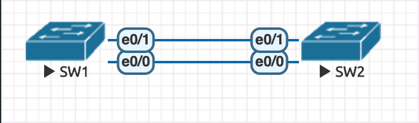

# EtherChannel

- 用途：頻寬加倍
- 

```
// SW1
Switch>enable
Switch#configure terminal
Switch(config)#interface range e0/0-1
Switch(config-if-range)#switchport trunk encapsulation dot1q
Switch(config-if-range)#switchport mode trunk
Switch(config-if-range)#channel-group 1 mode on
Switch(config-if-range)#exit


// SW2
Switch>enable
Switch#configure terminal
Switch(config)#interface range e0/0-1
Switch(config-if-range)#switchport trunk encapsulation dot1q
Switch(config-if-range)#switchport mode trunk
Switch(config-if-range)#channel-group 1 mode on
Switch(config-if-range)#exit


// SW1 or SW2
do show etherchannel summary // 可以查看 etherchannel 資訊
do show interface port-channel 1 // 原本頻寬為 10M/s，後來頻寬為 20M/s

```

## Reference

1. [Jan Ho 的網絡世界 - EtherChannel (PAgP and LACP) 以太通道](https://www.jannet.hk/zh-Hant/post/etherchannel-pagp-lacp/)
2. [Layer 3 Etherchannel on Cisco IOS Switch | NetworkLessons.com](https://networklessons.com/switching/layer-3-etherchannel-cisco-ios-switch)